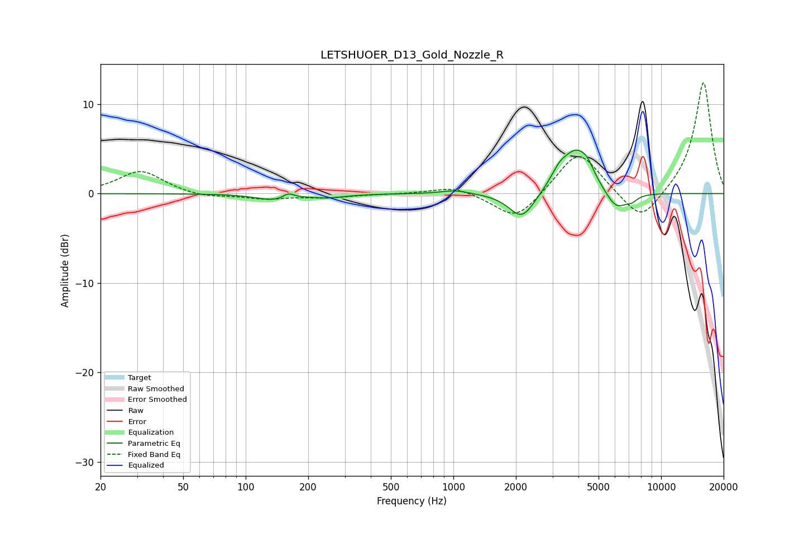

# LETSHUOER_D13_Gold_Nozzle_R
See [usage instructions](https://github.com/jaakkopasanen/AutoEq#usage) for more options and info.

### Parametric EQs
Apply preamp of -5.0 dB when using parametric equalizer.

|   # | Type    |   Fc (Hz) |    Q |   Gain (dB) |
|-----|---------|-----------|------|-------------|
|   1 | Peaking |       135 | 1.75 |        -0.7 |
|   2 | Peaking |       161 | 5.29 |         0.6 |
|   3 | Peaking |       248 | 1.68 |        -0.4 |
|   4 | Peaking |      1023 | 2.16 |         0.4 |
|   5 | Peaking |      2139 | 2.27 |        -3   |
|   6 | Peaking |      3233 | 3.41 |         1.3 |
|   7 | Peaking |      3931 | 1.96 |         4.7 |
|   8 | Peaking |      4426 | 5.03 |         0.8 |
|   9 | Peaking |      6076 | 2.52 |        -2.2 |
|  10 | Peaking |      7236 | 5.23 |        -0.5 |

### Fixed Band EQs
When using fixed band (also called graphic) equalizer, apply preamp of **-12.5 dB** (if available) and set gains manually with these parameters.

|   # | Type    |   Fc (Hz) |    Q |   Gain (dB) |
|-----|---------|-----------|------|-------------|
|   1 | Peaking |        31 | 1.41 |         2.6 |
|   2 | Peaking |        62 | 1.41 |        -0.5 |
|   3 | Peaking |       125 | 1.41 |        -0.5 |
|   4 | Peaking |       250 | 1.41 |        -0.4 |
|   5 | Peaking |       500 | 1.41 |        -0   |
|   6 | Peaking |      1000 | 1.41 |         0.9 |
|   7 | Peaking |      2000 | 1.41 |        -3.1 |
|   8 | Peaking |      4000 | 1.41 |         5   |
|   9 | Peaking |      8000 | 1.41 |        -3.5 |
|  10 | Peaking |     16000 | 1.41 |        12.6 |

### Graphs

