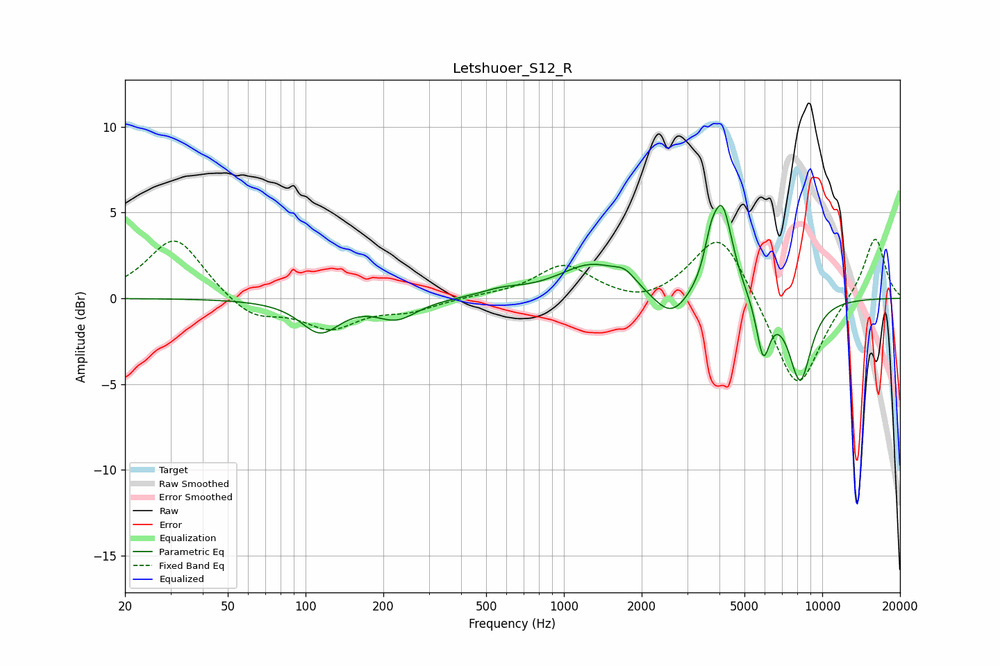

# Letshuoer_S12_R
See [usage instructions](https://github.com/jaakkopasanen/AutoEq#usage) for more options and info.

### Parametric EQs
Apply preamp of -5.5 dB when using parametric equalizer.

|   # | Type    |   Fc (Hz) |    Q |   Gain (dB) |
|-----|---------|-----------|------|-------------|
|   1 | Peaking |       114 | 1.86 |        -1.9 |
|   2 | Peaking |       225 | 1.84 |        -1.1 |
|   3 | Peaking |       577 | 1.77 |         0.3 |
|   4 | Peaking |      1285 | 1.1  |         1.9 |
|   5 | Peaking |      1727 | 3.52 |         0.6 |
|   6 | Peaking |      2596 | 2.06 |        -1.6 |
|   7 | Peaking |      3689 | 6    |         1.4 |
|   8 | Peaking |      4097 | 3.38 |         5.4 |
|   9 | Peaking |      5907 | 5.35 |        -3.3 |
|  10 | Peaking |      8209 | 2.97 |        -4.8 |

### Fixed Band EQs
When using fixed band (also called graphic) equalizer, apply preamp of **-3.5 dB** (if available) and set gains manually with these parameters.

|   # | Type    |   Fc (Hz) |    Q |   Gain (dB) |
|-----|---------|-----------|------|-------------|
|   1 | Peaking |        31 | 1.41 |         3.6 |
|   2 | Peaking |        62 | 1.41 |        -1.2 |
|   3 | Peaking |       125 | 1.41 |        -1.6 |
|   4 | Peaking |       250 | 1.41 |        -0.6 |
|   5 | Peaking |       500 | 1.41 |         0.1 |
|   6 | Peaking |      1000 | 1.41 |         1.9 |
|   7 | Peaking |      2000 | 1.41 |        -0.5 |
|   8 | Peaking |      4000 | 1.41 |         4.1 |
|   9 | Peaking |      8000 | 1.41 |        -5.6 |
|  10 | Peaking |     16000 | 1.41 |         3.7 |

### Graphs

