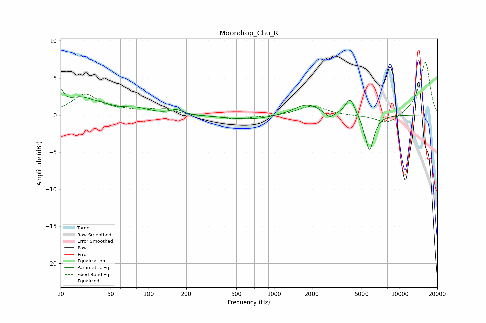

# Moondrop_Chu_R
See [usage instructions](https://github.com/jaakkopasanen/AutoEq#usage) for more options and info.

### Parametric EQs
Apply preamp of -3.6 dB when using parametric equalizer.

|   # | Type    |   Fc (Hz) |    Q |   Gain (dB) |
|-----|---------|-----------|------|-------------|
|   1 | Peaking |        20 | 5.92 |         2   |
|   2 | Peaking |        30 | 0.92 |         2.5 |
|   3 | Peaking |        36 | 2.69 |        -0.3 |
|   4 | Peaking |        82 | 1.51 |         0.6 |
|   5 | Peaking |       167 | 2.97 |         0.6 |
|   6 | Peaking |       642 | 0.7  |        -0.6 |
|   7 | Peaking |      1826 | 1.35 |         1.6 |
|   8 | Peaking |      2774 | 3.71 |        -0.9 |
|   9 | Peaking |      4042 | 3.63 |         2.4 |
|  10 | Peaking |      5738 | 3.89 |        -5   |

### Fixed Band EQs
When using fixed band (also called graphic) equalizer, apply preamp of **-7.2 dB** (if available) and set gains manually with these parameters.

|   # | Type    |   Fc (Hz) |    Q |   Gain (dB) |
|-----|---------|-----------|------|-------------|
|   1 | Peaking |        31 | 1.41 |         2.7 |
|   2 | Peaking |        62 | 1.41 |         0.4 |
|   3 | Peaking |       125 | 1.41 |         0.8 |
|   4 | Peaking |       250 | 1.41 |        -0.1 |
|   5 | Peaking |       500 | 1.41 |        -0.6 |
|   6 | Peaking |      1000 | 1.41 |        -0.2 |
|   7 | Peaking |      2000 | 1.41 |         1.3 |
|   8 | Peaking |      4000 | 1.41 |        -0.1 |
|   9 | Peaking |      8000 | 1.41 |        -1.3 |
|  10 | Peaking |     16000 | 1.41 |         7.2 |

### Graphs

