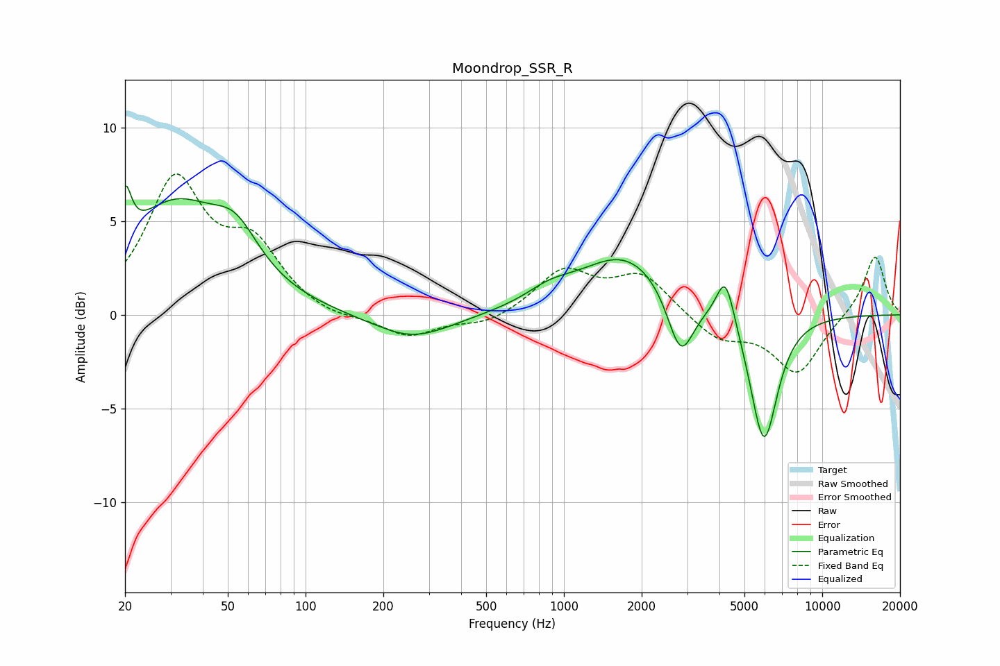

# Moondrop_SSR_R
See [usage instructions](https://github.com/jaakkopasanen/AutoEq#usage) for more options and info.

### Parametric EQs
Apply preamp of -7.0 dB when using parametric equalizer.

|   # | Type    |   Fc (Hz) |    Q |   Gain (dB) |
|-----|---------|-----------|------|-------------|
|   1 | Peaking |        20 | 5.99 |         2.9 |
|   2 | Peaking |        31 | 0.73 |         5.6 |
|   3 | Peaking |        54 | 1.58 |         2.2 |
|   4 | Peaking |       196 | 5.96 |         0   |
|   5 | Peaking |       258 | 0.91 |        -1.4 |
|   6 | Peaking |       878 | 1.55 |         0.7 |
|   7 | Peaking |      1744 | 0.78 |         3.2 |
|   8 | Peaking |      2830 | 2.75 |        -3.5 |
|   9 | Peaking |      4223 | 3.99 |         2.6 |
|  10 | Peaking |      5946 | 2.55 |        -7   |

### Fixed Band EQs
When using fixed band (also called graphic) equalizer, apply preamp of **-7.6 dB** (if available) and set gains manually with these parameters.

|   # | Type    |   Fc (Hz) |    Q |   Gain (dB) |
|-----|---------|-----------|------|-------------|
|   1 | Peaking |        31 | 1.41 |         6.9 |
|   2 | Peaking |        62 | 1.41 |         3.3 |
|   3 | Peaking |       125 | 1.41 |        -0.3 |
|   4 | Peaking |       250 | 1.41 |        -1.2 |
|   5 | Peaking |       500 | 1.41 |        -0.6 |
|   6 | Peaking |      1000 | 1.41 |         2.3 |
|   7 | Peaking |      2000 | 1.41 |         2.1 |
|   8 | Peaking |      4000 | 1.41 |        -1.3 |
|   9 | Peaking |      8000 | 1.41 |        -3.1 |
|  10 | Peaking |     16000 | 1.41 |         3.2 |

### Graphs

