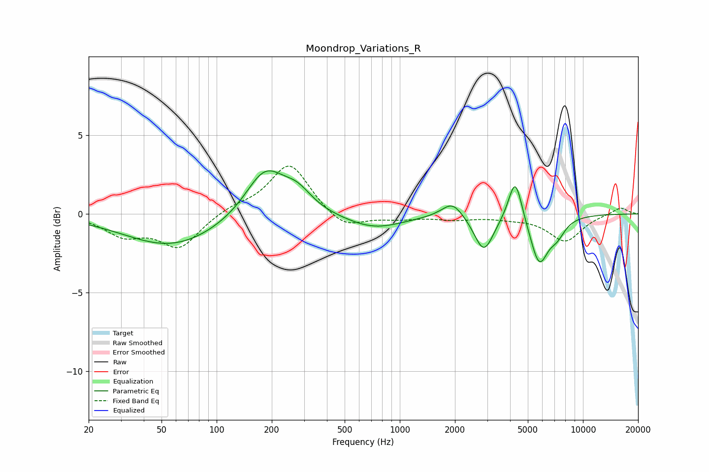

# Moondrop_Variations_R
See [usage instructions](https://github.com/jaakkopasanen/AutoEq#usage) for more options and info.

### Parametric EQs
Apply preamp of -2.8 dB when using parametric equalizer.

|   # | Type    |   Fc (Hz) |    Q |   Gain (dB) |
|-----|---------|-----------|------|-------------|
|   1 | Peaking |        31 | 1.62 |        -0   |
|   2 | Peaking |        57 | 0.55 |        -2   |
|   3 | Peaking |       184 | 1.34 |         3   |
|   4 | Peaking |       276 | 1.75 |         1.2 |
|   5 | Peaking |       724 | 0.9  |        -0.9 |
|   6 | Peaking |      1939 | 2.41 |         1   |
|   7 | Peaking |      2877 | 2.69 |        -2.4 |
|   8 | Peaking |      4270 | 3.8  |         2.8 |
|   9 | Peaking |      5766 | 2.83 |        -3   |
|  10 | Peaking |      7217 | 3    |        -0.9 |

### Fixed Band EQs
When using fixed band (also called graphic) equalizer, apply preamp of **-3.1 dB** (if available) and set gains manually with these parameters.

|   # | Type    |   Fc (Hz) |    Q |   Gain (dB) |
|-----|---------|-----------|------|-------------|
|   1 | Peaking |        31 | 1.41 |        -1.2 |
|   2 | Peaking |        62 | 1.41 |        -2.1 |
|   3 | Peaking |       125 | 1.41 |         0.4 |
|   4 | Peaking |       250 | 1.41 |         3.2 |
|   5 | Peaking |       500 | 1.41 |        -1   |
|   6 | Peaking |      1000 | 1.41 |        -0.3 |
|   7 | Peaking |      2000 | 1.41 |        -0.3 |
|   8 | Peaking |      4000 | 1.41 |        -0.2 |
|   9 | Peaking |      8000 | 1.41 |        -1.7 |
|  10 | Peaking |     16000 | 1.41 |         0.4 |

### Graphs

