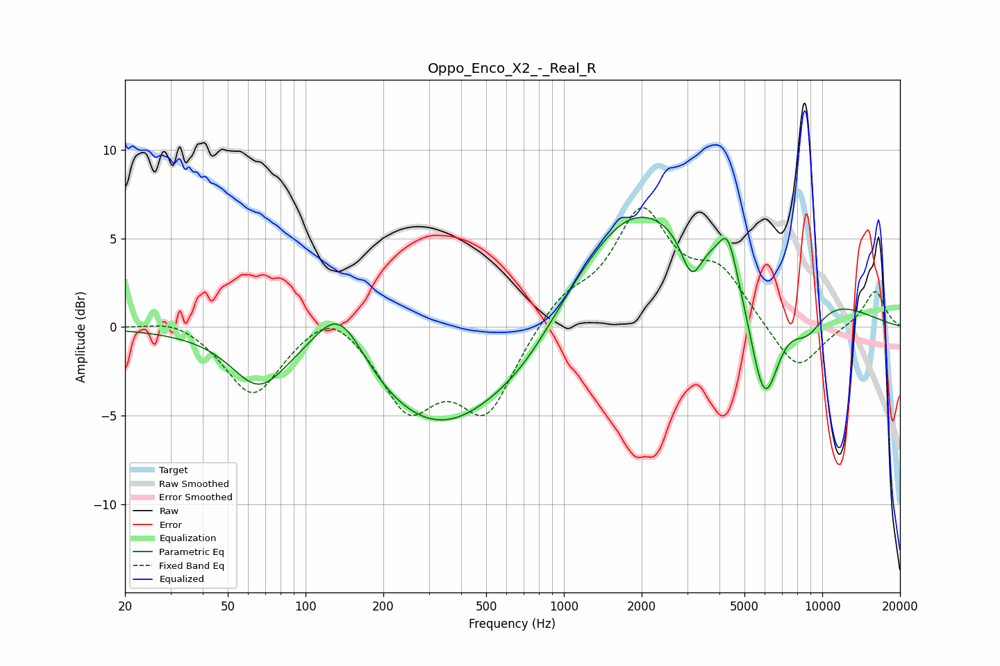

# Oppo_Enco_X2_-_Real_R
See [usage instructions](https://github.com/jaakkopasanen/AutoEq#usage) for more options and info.

### Parametric EQs
Apply preamp of -6.3 dB when using parametric equalizer.

|   # | Type    |   Fc (Hz) |    Q |   Gain (dB) |
|-----|---------|-----------|------|-------------|
|   1 | Peaking |        66 | 1.36 |        -2.8 |
|   2 | Peaking |       135 | 1.39 |         3.7 |
|   3 | Peaking |       355 | 0.45 |        -6.8 |
|   4 | Peaking |       722 | 0.95 |        -1.5 |
|   5 | Peaking |      1788 | 0.89 |         2   |
|   6 | Peaking |      2503 | 0.23 |         6.1 |
|   7 | Peaking |      3120 | 3.4  |        -2.6 |
|   8 | Peaking |      4315 | 4.13 |         2.2 |
|   9 | Peaking |      5963 | 2.09 |        -7.8 |
|  10 | Peaking |      8696 | 1.77 |        -2.3 |

### Fixed Band EQs
When using fixed band (also called graphic) equalizer, apply preamp of **-6.8 dB** (if available) and set gains manually with these parameters.

|   # | Type    |   Fc (Hz) |    Q |   Gain (dB) |
|-----|---------|-----------|------|-------------|
|   1 | Peaking |        31 | 1.41 |         0.6 |
|   2 | Peaking |        62 | 1.41 |        -3.9 |
|   3 | Peaking |       125 | 1.41 |         1.6 |
|   4 | Peaking |       250 | 1.41 |        -4.3 |
|   5 | Peaking |       500 | 1.41 |        -4.7 |
|   6 | Peaking |      1000 | 1.41 |         1.6 |
|   7 | Peaking |      2000 | 1.41 |         6.2 |
|   8 | Peaking |      4000 | 1.41 |         2.8 |
|   9 | Peaking |      8000 | 1.41 |        -2.7 |
|  10 | Peaking |     16000 | 1.41 |         2.1 |

### Graphs

