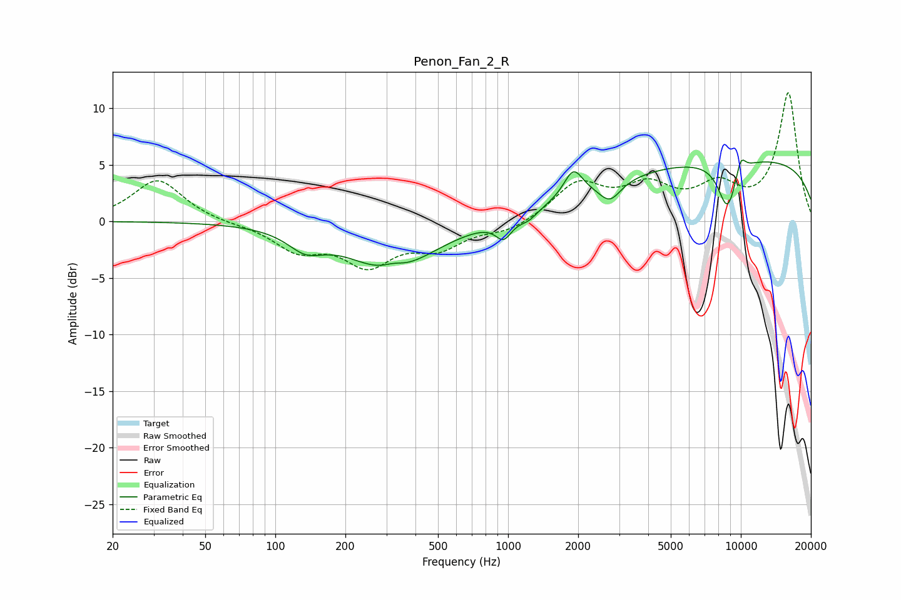

# Penon_Fan_2_R
See [usage instructions](https://github.com/jaakkopasanen/AutoEq#usage) for more options and info.

### Parametric EQs
Apply preamp of -5.5 dB when using parametric equalizer.

|   # | Type    |   Fc (Hz) |    Q |   Gain (dB) |
|-----|---------|-----------|------|-------------|
|   1 | Peaking |       135 | 1.84 |        -1.6 |
|   2 | Peaking |       315 | 0.78 |        -4.3 |
|   3 | Peaking |       321 | 3.02 |         0.5 |
|   4 | Peaking |       958 | 4.11 |        -1.6 |
|   5 | Peaking |      1224 | 3.6  |        -0.7 |
|   6 | Peaking |      1907 | 3.47 |         2.5 |
|   7 | Peaking |      2739 | 3.05 |        -1.7 |
|   8 | Peaking |      8761 | 3.17 |        -4.3 |
|   9 | Peaking |     10000 | 0.18 |         5.6 |
|  10 | Peaking |     10000 | 5.87 |         1.5 |

### Fixed Band EQs
When using fixed band (also called graphic) equalizer, apply preamp of **-11.4 dB** (if available) and set gains manually with these parameters.

|   # | Type    |   Fc (Hz) |    Q |   Gain (dB) |
|-----|---------|-----------|------|-------------|
|   1 | Peaking |        31 | 1.41 |         3.7 |
|   2 | Peaking |        62 | 1.41 |        -0.2 |
|   3 | Peaking |       125 | 1.41 |        -2.3 |
|   4 | Peaking |       250 | 1.41 |        -3.5 |
|   5 | Peaking |       500 | 1.41 |        -2.1 |
|   6 | Peaking |      1000 | 1.41 |        -0.9 |
|   7 | Peaking |      2000 | 1.41 |         3.2 |
|   8 | Peaking |      4000 | 1.41 |         2.7 |
|   9 | Peaking |      8000 | 1.41 |         2.7 |
|  10 | Peaking |     16000 | 1.41 |        11.3 |

### Graphs

