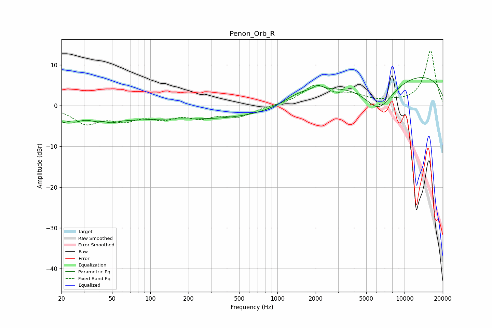

# Penon_Orb_R
See [usage instructions](https://github.com/jaakkopasanen/AutoEq#usage) for more options and info.

### Parametric EQs
Apply preamp of -7.0 dB when using parametric equalizer.

|   # | Type    |   Fc (Hz) |    Q |   Gain (dB) |
|-----|---------|-----------|------|-------------|
|   1 | Peaking |        20 | 5.57 |        -1.9 |
|   2 | Peaking |        25 | 2.24 |        -2.4 |
|   3 | Peaking |        43 | 3.52 |         1.3 |
|   4 | Peaking |        43 | 1.53 |        -3.5 |
|   5 | Peaking |        77 | 1.1  |        -0.7 |
|   6 | Peaking |       350 | 0.18 |        -3.4 |
|   7 | Peaking |      1484 | 1.07 |         2.3 |
|   8 | Peaking |      2078 | 3.83 |         1.2 |
|   9 | Peaking |      6259 | 1.09 |        -8.3 |
|  10 | Peaking |      9019 | 0.18 |         8.5 |

### Fixed Band EQs
When using fixed band (also called graphic) equalizer, apply preamp of **-13.6 dB** (if available) and set gains manually with these parameters.

|   # | Type    |   Fc (Hz) |    Q |   Gain (dB) |
|-----|---------|-----------|------|-------------|
|   1 | Peaking |        31 | 1.41 |        -4.1 |
|   2 | Peaking |        62 | 1.41 |        -2.9 |
|   3 | Peaking |       125 | 1.41 |        -2.5 |
|   4 | Peaking |       250 | 1.41 |        -2.4 |
|   5 | Peaking |       500 | 1.41 |        -2.5 |
|   6 | Peaking |      1000 | 1.41 |        -0   |
|   7 | Peaking |      2000 | 1.41 |         4.8 |
|   8 | Peaking |      4000 | 1.41 |         2   |
|   9 | Peaking |      8000 | 1.41 |         0.6 |
|  10 | Peaking |     16000 | 1.41 |        13.5 |

### Graphs

