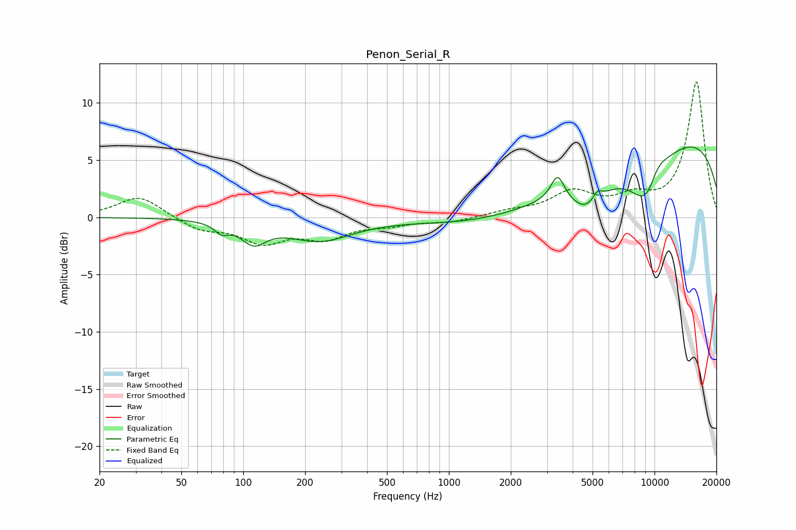

# Penon_Serial_R
See [usage instructions](https://github.com/jaakkopasanen/AutoEq#usage) for more options and info.

### Parametric EQs
Apply preamp of -6.2 dB when using parametric equalizer.

|   # | Type    |   Fc (Hz) |    Q |   Gain (dB) |
|-----|---------|-----------|------|-------------|
|   1 | Peaking |        79 | 4.18 |        -0.8 |
|   2 | Peaking |       112 | 2.36 |        -1.8 |
|   3 | Peaking |       235 | 0.89 |        -1.9 |
|   4 | Peaking |      3226 | 0.33 |        -3.3 |
|   5 | Peaking |      3379 | 4.24 |         2.3 |
|   6 | Peaking |      4696 | 1.64 |        -2.4 |
|   7 | Peaking |      5270 | 5.92 |         0.9 |
|   8 | Peaking |      9434 | 1.51 |        -7.6 |
|   9 | Peaking |      9913 | 0.18 |         7.8 |
|  10 | Peaking |     10000 | 1.88 |         4.5 |

### Fixed Band EQs
When using fixed band (also called graphic) equalizer, apply preamp of **-11.9 dB** (if available) and set gains manually with these parameters.

|   # | Type    |   Fc (Hz) |    Q |   Gain (dB) |
|-----|---------|-----------|------|-------------|
|   1 | Peaking |        31 | 1.41 |         1.9 |
|   2 | Peaking |        62 | 1.41 |        -1   |
|   3 | Peaking |       125 | 1.41 |        -2   |
|   4 | Peaking |       250 | 1.41 |        -1.6 |
|   5 | Peaking |       500 | 1.41 |        -0.5 |
|   6 | Peaking |      1000 | 1.41 |        -0.4 |
|   7 | Peaking |      2000 | 1.41 |         0.4 |
|   8 | Peaking |      4000 | 1.41 |         2.1 |
|   9 | Peaking |      8000 | 1.41 |         1.4 |
|  10 | Peaking |     16000 | 1.41 |        11.8 |

### Graphs

