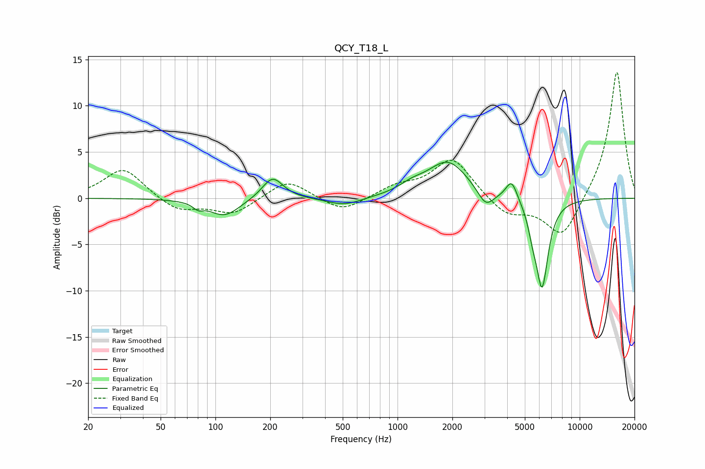

# QCY_T18_L
See [usage instructions](https://github.com/jaakkopasanen/AutoEq#usage) for more options and info.

### Parametric EQs
Apply preamp of -4.0 dB when using parametric equalizer.

|   # | Type    |   Fc (Hz) |    Q |   Gain (dB) |
|-----|---------|-----------|------|-------------|
|   1 | Peaking |        80 | 5.39 |        -0.6 |
|   2 | Peaking |       112 | 1.68 |        -1.9 |
|   3 | Peaking |       206 | 2.46 |         2.4 |
|   4 | Peaking |       509 | 1.48 |        -0.9 |
|   5 | Peaking |      1197 | 1.97 |         0.8 |
|   6 | Peaking |      1890 | 1.28 |         3.9 |
|   7 | Peaking |      3048 | 3.22 |        -1.8 |
|   8 | Peaking |      4230 | 4.45 |         2.2 |
|   9 | Peaking |      5516 | 5.99 |        -1.6 |
|  10 | Peaking |      6213 | 4.01 |        -9.5 |

### Fixed Band EQs
When using fixed band (also called graphic) equalizer, apply preamp of **-13.7 dB** (if available) and set gains manually with these parameters.

|   # | Type    |   Fc (Hz) |    Q |   Gain (dB) |
|-----|---------|-----------|------|-------------|
|   1 | Peaking |        31 | 1.41 |         3.3 |
|   2 | Peaking |        62 | 1.41 |        -1.5 |
|   3 | Peaking |       125 | 1.41 |        -1.7 |
|   4 | Peaking |       250 | 1.41 |         2.1 |
|   5 | Peaking |       500 | 1.41 |        -1.6 |
|   6 | Peaking |      1000 | 1.41 |         1.2 |
|   7 | Peaking |      2000 | 1.41 |         4.3 |
|   8 | Peaking |      4000 | 1.41 |        -1.9 |
|   9 | Peaking |      8000 | 1.41 |        -4.5 |
|  10 | Peaking |     16000 | 1.41 |        13.9 |

### Graphs

