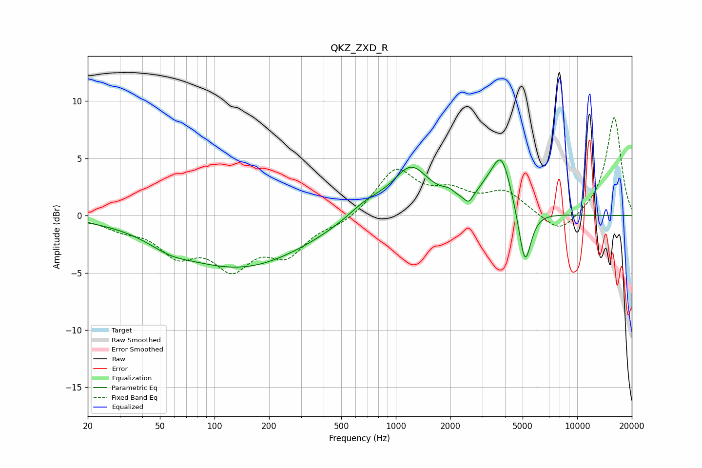

# QKZ_ZXD_R
See [usage instructions](https://github.com/jaakkopasanen/AutoEq#usage) for more options and info.

### Parametric EQs
Apply preamp of -5.0 dB when using parametric equalizer.

|   # | Type    |   Fc (Hz) |    Q |   Gain (dB) |
|-----|---------|-----------|------|-------------|
|   1 | Peaking |        57 | 1.32 |        -0.7 |
|   2 | Peaking |       139 | 0.39 |        -4.5 |
|   3 | Peaking |       685 | 1.32 |         1.2 |
|   4 | Peaking |      1246 | 1.33 |         4.6 |
|   5 | Peaking |      1390 | 2.06 |        -0.6 |
|   6 | Peaking |      1959 | 4.19 |         0.5 |
|   7 | Peaking |      2523 | 6    |        -0.8 |
|   8 | Peaking |      3170 | 2.17 |         1.1 |
|   9 | Peaking |      3827 | 2.61 |         4.5 |
|  10 | Peaking |      5149 | 4.08 |        -5.1 |

### Fixed Band EQs
When using fixed band (also called graphic) equalizer, apply preamp of **-8.6 dB** (if available) and set gains manually with these parameters.

|   # | Type    |   Fc (Hz) |    Q |   Gain (dB) |
|-----|---------|-----------|------|-------------|
|   1 | Peaking |        31 | 1.41 |        -0.9 |
|   2 | Peaking |        62 | 1.41 |        -2.9 |
|   3 | Peaking |       125 | 1.41 |        -4   |
|   4 | Peaking |       250 | 1.41 |        -3   |
|   5 | Peaking |       500 | 1.41 |        -0.7 |
|   6 | Peaking |      1000 | 1.41 |         3.9 |
|   7 | Peaking |      2000 | 1.41 |         1.7 |
|   8 | Peaking |      4000 | 1.41 |         1.9 |
|   9 | Peaking |      8000 | 1.41 |        -1.8 |
|  10 | Peaking |     16000 | 1.41 |         8.7 |

### Graphs

