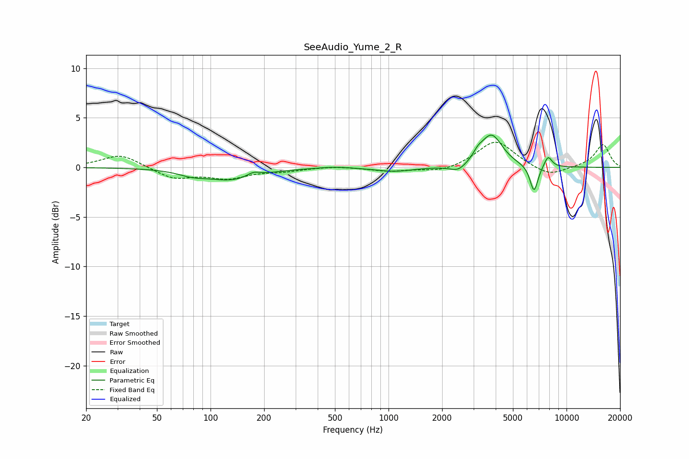

# SeeAudio_Yume_2_R
See [usage instructions](https://github.com/jaakkopasanen/AutoEq#usage) for more options and info.

### Parametric EQs
Apply preamp of -3.4 dB when using parametric equalizer.

|   # | Type    |   Fc (Hz) |    Q |   Gain (dB) |
|-----|---------|-----------|------|-------------|
|   1 | Peaking |        78 | 1.91 |        -0.4 |
|   2 | Peaking |       131 | 0.96 |        -1.2 |
|   3 | Peaking |       174 | 3.74 |         0.5 |
|   4 | Peaking |       494 | 1.54 |         0.2 |
|   5 | Peaking |      1083 | 1.31 |        -0.4 |
|   6 | Peaking |      2466 | 3.01 |        -0.7 |
|   7 | Peaking |      3176 | 5.46 |         0.5 |
|   8 | Peaking |      3786 | 2.29 |         3.3 |
|   9 | Peaking |      6566 | 5.98 |        -2.7 |
|  10 | Peaking |      7874 | 6    |         1.2 |

### Fixed Band EQs
When using fixed band (also called graphic) equalizer, apply preamp of **-2.6 dB** (if available) and set gains manually with these parameters.

|   # | Type    |   Fc (Hz) |    Q |   Gain (dB) |
|-----|---------|-----------|------|-------------|
|   1 | Peaking |        31 | 1.41 |         1.4 |
|   2 | Peaking |        62 | 1.41 |        -1.1 |
|   3 | Peaking |       125 | 1.41 |        -1   |
|   4 | Peaking |       250 | 1.41 |        -0.3 |
|   5 | Peaking |       500 | 1.41 |         0.2 |
|   6 | Peaking |      1000 | 1.41 |        -0.4 |
|   7 | Peaking |      2000 | 1.41 |        -0.5 |
|   8 | Peaking |      4000 | 1.41 |         2.8 |
|   9 | Peaking |      8000 | 1.41 |        -1   |
|  10 | Peaking |     16000 | 1.41 |         2.3 |

### Graphs

