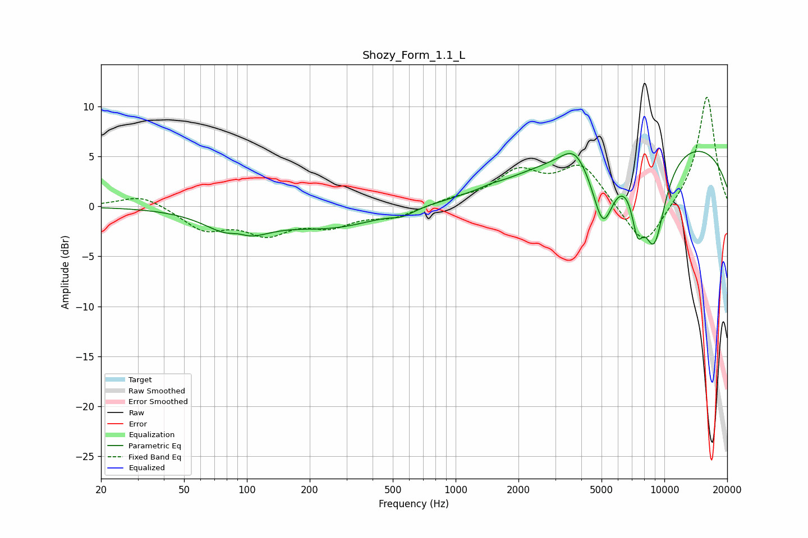

# Shozy_Form_1.1_L
See [usage instructions](https://github.com/jaakkopasanen/AutoEq#usage) for more options and info.

### Parametric EQs
Apply preamp of -5.6 dB when using parametric equalizer.

|   # | Type    |   Fc (Hz) |    Q |   Gain (dB) |
|-----|---------|-----------|------|-------------|
|   1 | Peaking |        90 | 2.69 |         0.9 |
|   2 | Peaking |        91 | 1.14 |        -3.1 |
|   3 | Peaking |       258 | 0.63 |        -1.9 |
|   4 | Peaking |       557 | 2.77 |        -0.5 |
|   5 | Peaking |      1477 | 4.05 |         0.1 |
|   6 | Peaking |      3706 | 2.33 |         1.8 |
|   7 | Peaking |      5082 | 2.6  |        -6.7 |
|   8 | Peaking |      7435 | 4.76 |        -4.2 |
|   9 | Peaking |      8917 | 2.11 |        -9.6 |
|  10 | Peaking |      9290 | 0.19 |         7   |

### Fixed Band EQs
When using fixed band (also called graphic) equalizer, apply preamp of **-11.0 dB** (if available) and set gains manually with these parameters.

|   # | Type    |   Fc (Hz) |    Q |   Gain (dB) |
|-----|---------|-----------|------|-------------|
|   1 | Peaking |        31 | 1.41 |         1.2 |
|   2 | Peaking |        62 | 1.41 |        -2.2 |
|   3 | Peaking |       125 | 1.41 |        -2.4 |
|   4 | Peaking |       250 | 1.41 |        -1.7 |
|   5 | Peaking |       500 | 1.41 |        -1   |
|   6 | Peaking |      1000 | 1.41 |         0.6 |
|   7 | Peaking |      2000 | 1.41 |         3.2 |
|   8 | Peaking |      4000 | 1.41 |         4   |
|   9 | Peaking |      8000 | 1.41 |        -4.5 |
|  10 | Peaking |     16000 | 1.41 |        11.2 |

### Graphs

