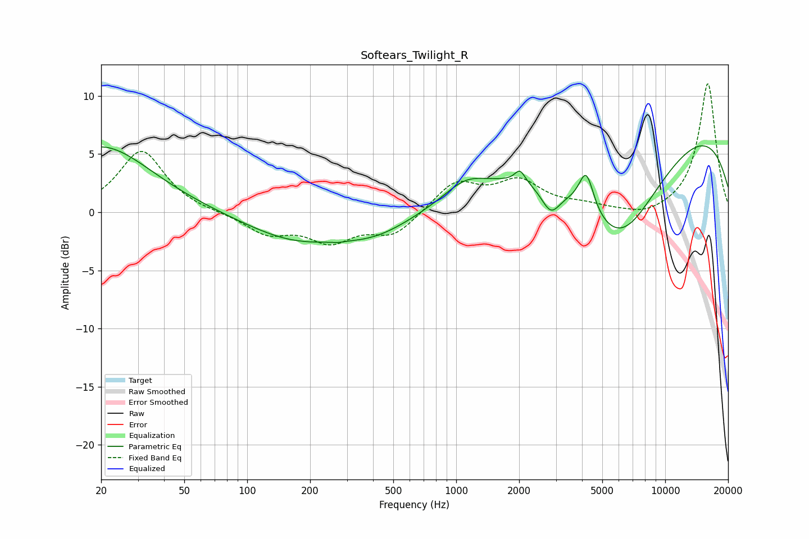

# Softears_Twilight_R
See [usage instructions](https://github.com/jaakkopasanen/AutoEq#usage) for more options and info.

### Parametric EQs
Apply preamp of -5.8 dB when using parametric equalizer.

|   # | Type    |   Fc (Hz) |    Q |   Gain (dB) |
|-----|---------|-----------|------|-------------|
|   1 | Peaking |        20 | 0.59 |         5.7 |
|   2 | Peaking |       167 | 0.6  |        -2.2 |
|   3 | Peaking |       271 | 5.89 |        -0.1 |
|   4 | Peaking |       411 | 0.74 |        -1.7 |
|   5 | Peaking |      1105 | 1.45 |         1.4 |
|   6 | Peaking |      2019 | 5.76 |         1.1 |
|   7 | Peaking |      2833 | 3.06 |        -2.3 |
|   8 | Peaking |      4192 | 3.99 |         3.4 |
|   9 | Peaking |      6011 | 0.61 |       -10.6 |
|  10 | Peaking |      8280 | 0.18 |         9.2 |

### Fixed Band EQs
When using fixed band (also called graphic) equalizer, apply preamp of **-11.1 dB** (if available) and set gains manually with these parameters.

|   # | Type    |   Fc (Hz) |    Q |   Gain (dB) |
|-----|---------|-----------|------|-------------|
|   1 | Peaking |        31 | 1.41 |         5.3 |
|   2 | Peaking |        62 | 1.41 |        -0   |
|   3 | Peaking |       125 | 1.41 |        -1.7 |
|   4 | Peaking |       250 | 1.41 |        -2.3 |
|   5 | Peaking |       500 | 1.41 |        -1.9 |
|   6 | Peaking |      1000 | 1.41 |         2.6 |
|   7 | Peaking |      2000 | 1.41 |         2.5 |
|   8 | Peaking |      4000 | 1.41 |         0.5 |
|   9 | Peaking |      8000 | 1.41 |        -0.5 |
|  10 | Peaking |     16000 | 1.41 |        11.1 |

### Graphs

