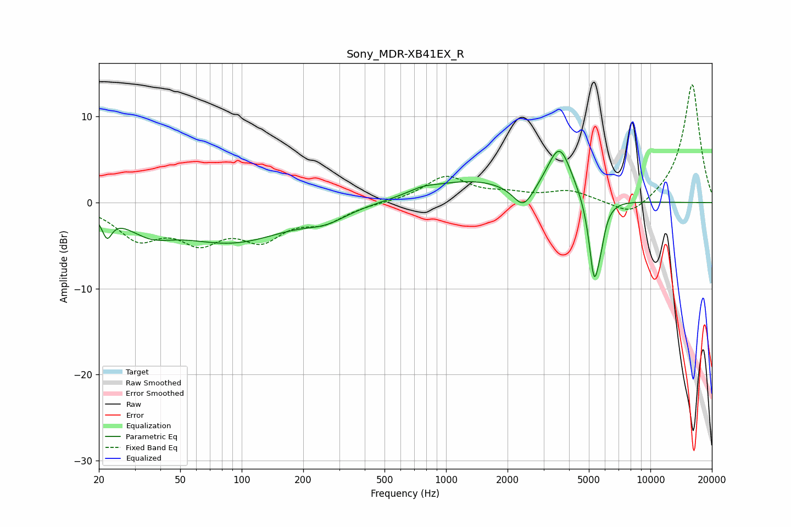

# Sony_MDR-XB41EX_R
See [usage instructions](https://github.com/jaakkopasanen/AutoEq#usage) for more options and info.

### Parametric EQs
Apply preamp of -6.1 dB when using parametric equalizer.

|   # | Type    |   Fc (Hz) |    Q |   Gain (dB) |
|-----|---------|-----------|------|-------------|
|   1 | Peaking |        22 | 5.99 |        -2.4 |
|   2 | Peaking |        36 | 1.26 |        -2.2 |
|   3 | Peaking |        90 | 0.52 |        -4.4 |
|   4 | Peaking |       259 | 1.39 |        -1.2 |
|   5 | Peaking |       764 | 2.16 |         0.5 |
|   6 | Peaking |      1318 | 0.61 |         2.5 |
|   7 | Peaking |      2391 | 2.86 |        -2.7 |
|   8 | Peaking |      3591 | 2.31 |         6.1 |
|   9 | Peaking |      5300 | 5.42 |        -8.9 |
|  10 | Peaking |      5693 | 6    |        -2.4 |

### Fixed Band EQs
When using fixed band (also called graphic) equalizer, apply preamp of **-13.8 dB** (if available) and set gains manually with these parameters.

|   # | Type    |   Fc (Hz) |    Q |   Gain (dB) |
|-----|---------|-----------|------|-------------|
|   1 | Peaking |        31 | 1.41 |        -3.8 |
|   2 | Peaking |        62 | 1.41 |        -3.8 |
|   3 | Peaking |       125 | 1.41 |        -3.7 |
|   4 | Peaking |       250 | 1.41 |        -2   |
|   5 | Peaking |       500 | 1.41 |         0   |
|   6 | Peaking |      1000 | 1.41 |         3   |
|   7 | Peaking |      2000 | 1.41 |         0.8 |
|   8 | Peaking |      4000 | 1.41 |         1.2 |
|   9 | Peaking |      8000 | 1.41 |        -1.9 |
|  10 | Peaking |     16000 | 1.41 |        13.9 |

### Graphs

