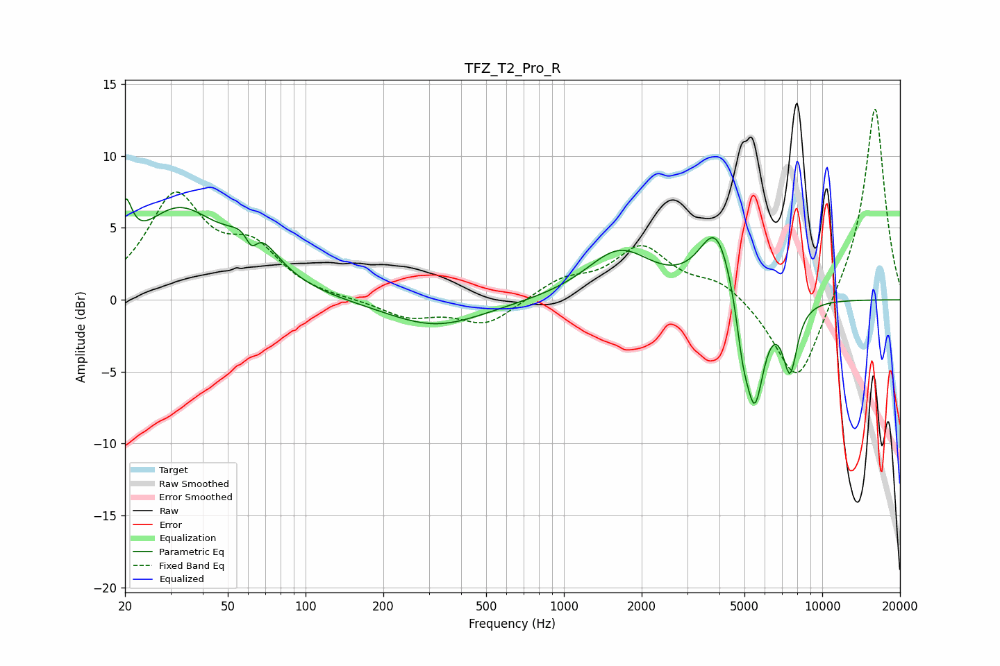

# TFZ_T2_Pro_R
See [usage instructions](https://github.com/jaakkopasanen/AutoEq#usage) for more options and info.

### Parametric EQs
Apply preamp of -7.1 dB when using parametric equalizer.

|   # | Type    |   Fc (Hz) |    Q |   Gain (dB) |
|-----|---------|-----------|------|-------------|
|   1 | Peaking |        20 | 5.44 |         3.5 |
|   2 | Peaking |        32 | 0.88 |         5.9 |
|   3 | Peaking |        62 | 6    |        -1.5 |
|   4 | Peaking |        63 | 1.7  |         3   |
|   5 | Peaking |       319 | 0.75 |        -1.9 |
|   6 | Peaking |      1639 | 1.11 |         3.4 |
|   7 | Peaking |      3897 | 2.11 |         4.9 |
|   8 | Peaking |      4919 | 5.63 |        -2.6 |
|   9 | Peaking |      5474 | 3.72 |        -7.6 |
|  10 | Peaking |      7508 | 4.68 |        -4.6 |

### Fixed Band EQs
When using fixed band (also called graphic) equalizer, apply preamp of **-13.4 dB** (if available) and set gains manually with these parameters.

|   # | Type    |   Fc (Hz) |    Q |   Gain (dB) |
|-----|---------|-----------|------|-------------|
|   1 | Peaking |        31 | 1.41 |         6.9 |
|   2 | Peaking |        62 | 1.41 |         3.1 |
|   3 | Peaking |       125 | 1.41 |        -0   |
|   4 | Peaking |       250 | 1.41 |        -1.2 |
|   5 | Peaking |       500 | 1.41 |        -1.7 |
|   6 | Peaking |      1000 | 1.41 |         1.3 |
|   7 | Peaking |      2000 | 1.41 |         3.5 |
|   8 | Peaking |      4000 | 1.41 |         1.3 |
|   9 | Peaking |      8000 | 1.41 |        -6.3 |
|  10 | Peaking |     16000 | 1.41 |        13.7 |

### Graphs

