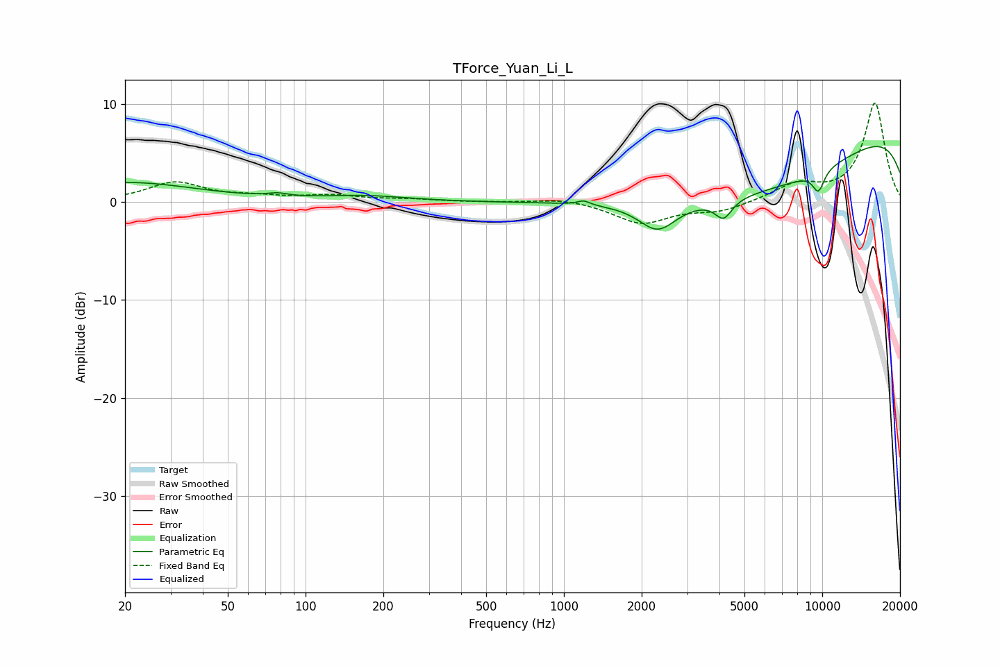

# TForce_Yuan_Li_L
See [usage instructions](https://github.com/jaakkopasanen/AutoEq#usage) for more options and info.

### Parametric EQs
Apply preamp of -5.8 dB when using parametric equalizer.

|   # | Type    |   Fc (Hz) |    Q |   Gain (dB) |
|-----|---------|-----------|------|-------------|
|   1 | Peaking |        20 | 0.51 |         2   |
|   2 | Peaking |        39 | 4.99 |        -0   |
|   3 | Peaking |        78 | 3.66 |         0.3 |
|   4 | Peaking |       170 | 0.88 |         0.6 |
|   5 | Peaking |      1193 | 5.9  |         0.4 |
|   6 | Peaking |      2306 | 1.96 |        -2.8 |
|   7 | Peaking |      4152 | 4.25 |        -1.9 |
|   8 | Peaking |      5727 | 0.3  |        -7.3 |
|   9 | Peaking |      9668 | 5.4  |        -2.1 |
|  10 | Peaking |     10000 | 0.18 |         9.4 |

### Fixed Band EQs
When using fixed band (also called graphic) equalizer, apply preamp of **-10.2 dB** (if available) and set gains manually with these parameters.

|   # | Type    |   Fc (Hz) |    Q |   Gain (dB) |
|-----|---------|-----------|------|-------------|
|   1 | Peaking |        31 | 1.41 |         2   |
|   2 | Peaking |        62 | 1.41 |         0.4 |
|   3 | Peaking |       125 | 1.41 |         0.6 |
|   4 | Peaking |       250 | 1.41 |         0.2 |
|   5 | Peaking |       500 | 1.41 |        -0   |
|   6 | Peaking |      1000 | 1.41 |         0.4 |
|   7 | Peaking |      2000 | 1.41 |        -2.2 |
|   8 | Peaking |      4000 | 1.41 |        -0.9 |
|   9 | Peaking |      8000 | 1.41 |         1.7 |
|  10 | Peaking |     16000 | 1.41 |        10.1 |

### Graphs

