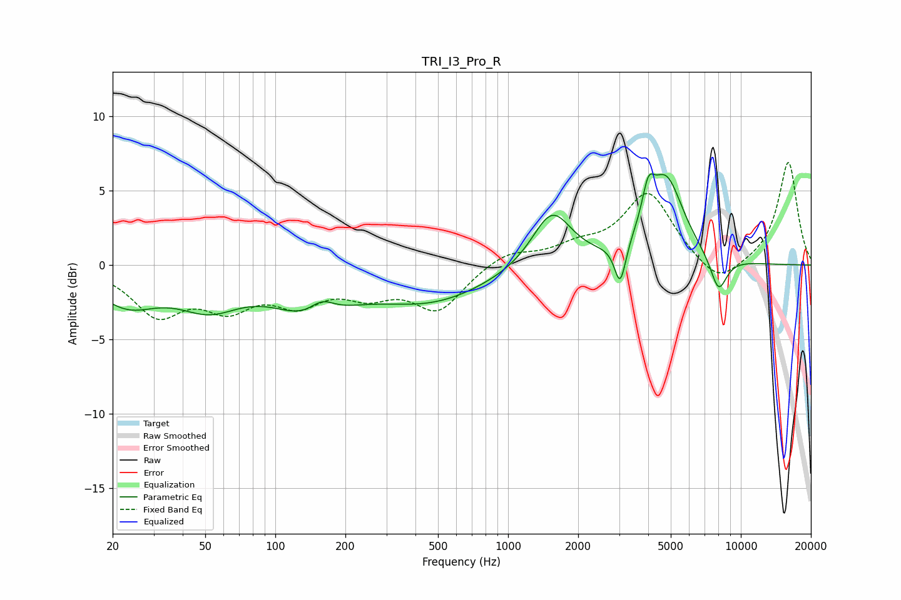

# TRI_I3_Pro_R
See [usage instructions](https://github.com/jaakkopasanen/AutoEq#usage) for more options and info.

### Parametric EQs
Apply preamp of -6.2 dB when using parametric equalizer.

|   # | Type    |   Fc (Hz) |    Q |   Gain (dB) |
|-----|---------|-----------|------|-------------|
|   1 | Peaking |        23 | 1.06 |        -2.4 |
|   2 | Peaking |        52 | 1.02 |        -2.3 |
|   3 | Peaking |       143 | 0.9  |        -2.7 |
|   4 | Peaking |       159 | 2.47 |         1.2 |
|   5 | Peaking |       468 | 0.56 |        -2.3 |
|   6 | Peaking |      1542 | 1.67 |         3.8 |
|   7 | Peaking |      3032 | 5.83 |        -2.9 |
|   8 | Peaking |      3998 | 5.53 |         2.2 |
|   9 | Peaking |      4757 | 1.81 |         5.7 |
|  10 | Peaking |      8020 | 3.63 |        -2.4 |

### Fixed Band EQs
When using fixed band (also called graphic) equalizer, apply preamp of **-7.0 dB** (if available) and set gains manually with these parameters.

|   # | Type    |   Fc (Hz) |    Q |   Gain (dB) |
|-----|---------|-----------|------|-------------|
|   1 | Peaking |        31 | 1.41 |        -3.1 |
|   2 | Peaking |        62 | 1.41 |        -2.4 |
|   3 | Peaking |       125 | 1.41 |        -2.2 |
|   4 | Peaking |       250 | 1.41 |        -1.6 |
|   5 | Peaking |       500 | 1.41 |        -2.9 |
|   6 | Peaking |      1000 | 1.41 |         0.9 |
|   7 | Peaking |      2000 | 1.41 |         1   |
|   8 | Peaking |      4000 | 1.41 |         4.8 |
|   9 | Peaking |      8000 | 1.41 |        -1.6 |
|  10 | Peaking |     16000 | 1.41 |         7   |

### Graphs

