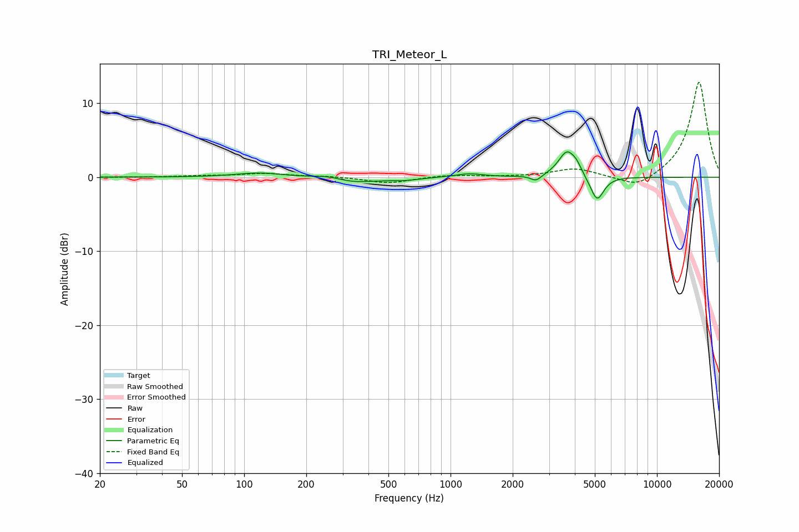

# TRI_Meteor_L
See [usage instructions](https://github.com/jaakkopasanen/AutoEq#usage) for more options and info.

### Parametric EQs
Apply preamp of -3.5 dB when using parametric equalizer.

|   # | Type    |   Fc (Hz) |    Q |   Gain (dB) |
|-----|---------|-----------|------|-------------|
|   1 | Peaking |       119 | 1.23 |         0.6 |
|   2 | Peaking |       263 | 1.69 |         0.8 |
|   3 | Peaking |       313 | 1.2  |        -0.5 |
|   4 | Peaking |       321 | 1.15 |        -0.5 |
|   5 | Peaking |       597 | 2.09 |        -0.3 |
|   6 | Peaking |      1232 | 2.15 |         0.5 |
|   7 | Peaking |      2598 | 5.57 |        -0.8 |
|   8 | Peaking |      3663 | 3.39 |         3.5 |
|   9 | Peaking |      4079 | 6    |         0.8 |
|  10 | Peaking |      5126 | 4.32 |        -3.4 |

### Fixed Band EQs
When using fixed band (also called graphic) equalizer, apply preamp of **-12.9 dB** (if available) and set gains manually with these parameters.

|   # | Type    |   Fc (Hz) |    Q |   Gain (dB) |
|-----|---------|-----------|------|-------------|
|   1 | Peaking |        31 | 1.41 |        -0   |
|   2 | Peaking |        62 | 1.41 |         0.2 |
|   3 | Peaking |       125 | 1.41 |         0.5 |
|   4 | Peaking |       250 | 1.41 |         0.1 |
|   5 | Peaking |       500 | 1.41 |        -0.8 |
|   6 | Peaking |      1000 | 1.41 |         0.3 |
|   7 | Peaking |      2000 | 1.41 |         0   |
|   8 | Peaking |      4000 | 1.41 |         1.2 |
|   9 | Peaking |      8000 | 1.41 |        -1.7 |
|  10 | Peaking |     16000 | 1.41 |        13   |

### Graphs

