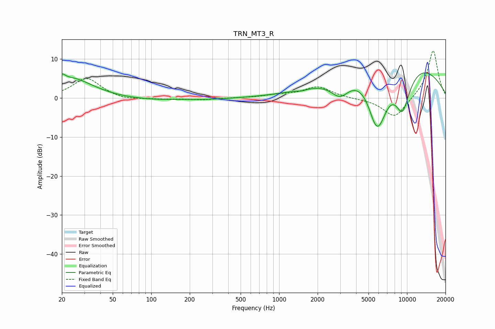

# TRN_MT3_R
See [usage instructions](https://github.com/jaakkopasanen/AutoEq#usage) for more options and info.

### Parametric EQs
Apply preamp of -6.5 dB when using parametric equalizer.

|   # | Type    |   Fc (Hz) |    Q |   Gain (dB) |
|-----|---------|-----------|------|-------------|
|   1 | Peaking |        20 | 5.63 |         1.6 |
|   2 | Peaking |        24 | 0.85 |         5.1 |
|   3 | Peaking |       135 | 0.4  |        -0.8 |
|   4 | Peaking |       160 | 1.34 |         0.2 |
|   5 | Peaking |      1501 | 4.38 |        -0.3 |
|   6 | Peaking |      2995 | 1.95 |        -4.4 |
|   7 | Peaking |      5671 | 2.36 |        -6   |
|   8 | Peaking |      6090 | 1.65 |       -10.2 |
|   9 | Peaking |      8208 | 0.33 |        13.1 |
|  10 | Peaking |      9206 | 1.72 |       -12.8 |

### Fixed Band EQs
When using fixed band (also called graphic) equalizer, apply preamp of **-12.1 dB** (if available) and set gains manually with these parameters.

|   # | Type    |   Fc (Hz) |    Q |   Gain (dB) |
|-----|---------|-----------|------|-------------|
|   1 | Peaking |        31 | 1.41 |         5.1 |
|   2 | Peaking |        62 | 1.41 |        -0.7 |
|   3 | Peaking |       125 | 1.41 |        -0.3 |
|   4 | Peaking |       250 | 1.41 |        -0.5 |
|   5 | Peaking |       500 | 1.41 |         0   |
|   6 | Peaking |      1000 | 1.41 |         0.6 |
|   7 | Peaking |      2000 | 1.41 |         2.9 |
|   8 | Peaking |      4000 | 1.41 |        -0.2 |
|   9 | Peaking |      8000 | 1.41 |        -5.3 |
|  10 | Peaking |     16000 | 1.41 |        12.4 |

### Graphs

