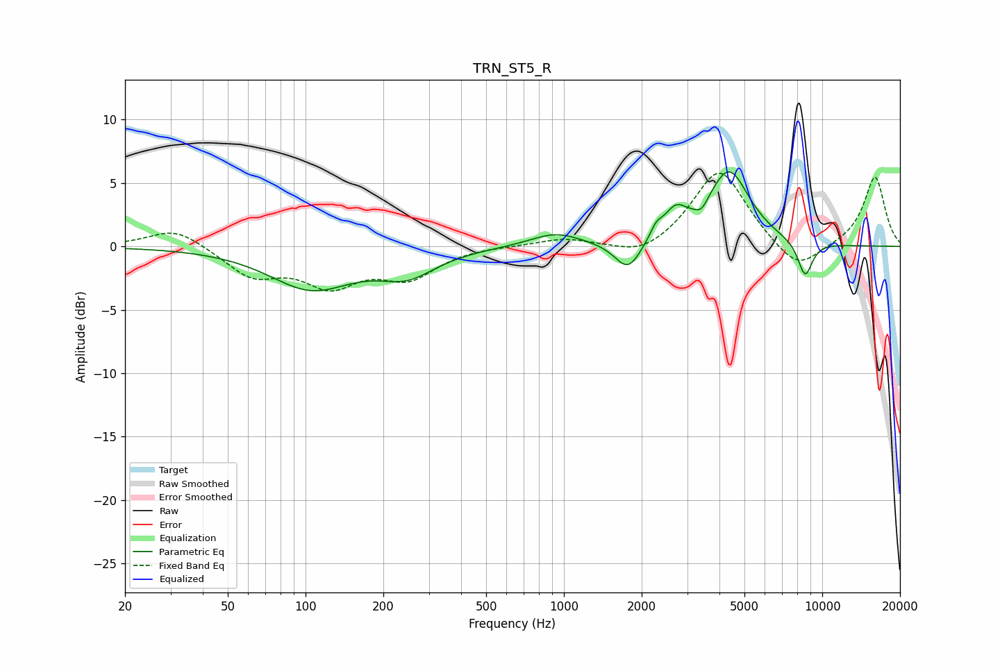

# TRN_ST5_R
See [usage instructions](https://github.com/jaakkopasanen/AutoEq#usage) for more options and info.

### Parametric EQs
Apply preamp of -6.0 dB when using parametric equalizer.

|   # | Type    |   Fc (Hz) |    Q |   Gain (dB) |
|-----|---------|-----------|------|-------------|
|   1 | Peaking |       105 | 0.87 |        -3.2 |
|   2 | Peaking |       248 | 1.28 |        -1.9 |
|   3 | Peaking |       929 | 1.42 |         1.1 |
|   4 | Peaking |      1772 | 2.78 |        -2.3 |
|   5 | Peaking |      2276 | 5.85 |         0.9 |
|   6 | Peaking |      2700 | 3.16 |         2   |
|   7 | Peaking |      3409 | 5.96 |        -0.7 |
|   8 | Peaking |      4346 | 1.71 |         5.7 |
|   9 | Peaking |      4451 | 3.27 |         0.2 |
|  10 | Peaking |      8585 | 4.54 |        -2.8 |

### Fixed Band EQs
When using fixed band (also called graphic) equalizer, apply preamp of **-5.9 dB** (if available) and set gains manually with these parameters.

|   # | Type    |   Fc (Hz) |    Q |   Gain (dB) |
|-----|---------|-----------|------|-------------|
|   1 | Peaking |        31 | 1.41 |         1.5 |
|   2 | Peaking |        62 | 1.41 |        -2.2 |
|   3 | Peaking |       125 | 1.41 |        -2.8 |
|   4 | Peaking |       250 | 1.41 |        -2.3 |
|   5 | Peaking |       500 | 1.41 |         0.1 |
|   6 | Peaking |      1000 | 1.41 |         0.6 |
|   7 | Peaking |      2000 | 1.41 |        -1   |
|   8 | Peaking |      4000 | 1.41 |         6.2 |
|   9 | Peaking |      8000 | 1.41 |        -2.2 |
|  10 | Peaking |     16000 | 1.41 |         5.5 |

### Graphs

