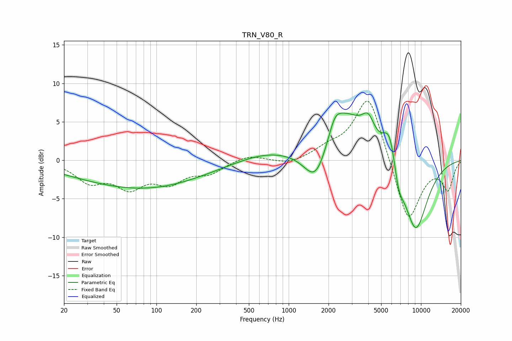

# TRN_V80_R
See [usage instructions](https://github.com/jaakkopasanen/AutoEq#usage) for more options and info.

### Parametric EQs
Apply preamp of -6.3 dB when using parametric equalizer.

|   # | Type    |   Fc (Hz) |    Q |   Gain (dB) |
|-----|---------|-----------|------|-------------|
|   1 | Peaking |        62 | 0.3  |        -2.9 |
|   2 | Peaking |       144 | 0.35 |        -0.9 |
|   3 | Peaking |       671 | 0.62 |         1.1 |
|   4 | Peaking |      1610 | 1.54 |        -5.3 |
|   5 | Peaking |      2232 | 2.99 |         2.1 |
|   6 | Peaking |      2653 | 0.9  |         6.4 |
|   7 | Peaking |      3991 | 2.94 |         2.8 |
|   8 | Peaking |      5809 | 2.6  |         5   |
|   9 | Peaking |      6752 | 3.51 |        -3   |
|  10 | Peaking |      9101 | 1.33 |        -9.5 |

### Fixed Band EQs
When using fixed band (also called graphic) equalizer, apply preamp of **-7.8 dB** (if available) and set gains manually with these parameters.

|   # | Type    |   Fc (Hz) |    Q |   Gain (dB) |
|-----|---------|-----------|------|-------------|
|   1 | Peaking |        31 | 1.41 |        -2.6 |
|   2 | Peaking |        62 | 1.41 |        -3.1 |
|   3 | Peaking |       125 | 1.41 |        -2.5 |
|   4 | Peaking |       250 | 1.41 |        -1.5 |
|   5 | Peaking |       500 | 1.41 |         0.8 |
|   6 | Peaking |      1000 | 1.41 |        -0.6 |
|   7 | Peaking |      2000 | 1.41 |         1.2 |
|   8 | Peaking |      4000 | 1.41 |         8.8 |
|   9 | Peaking |      8000 | 1.41 |        -8.5 |
|  10 | Peaking |     16000 | 1.41 |        -3.6 |

### Graphs

