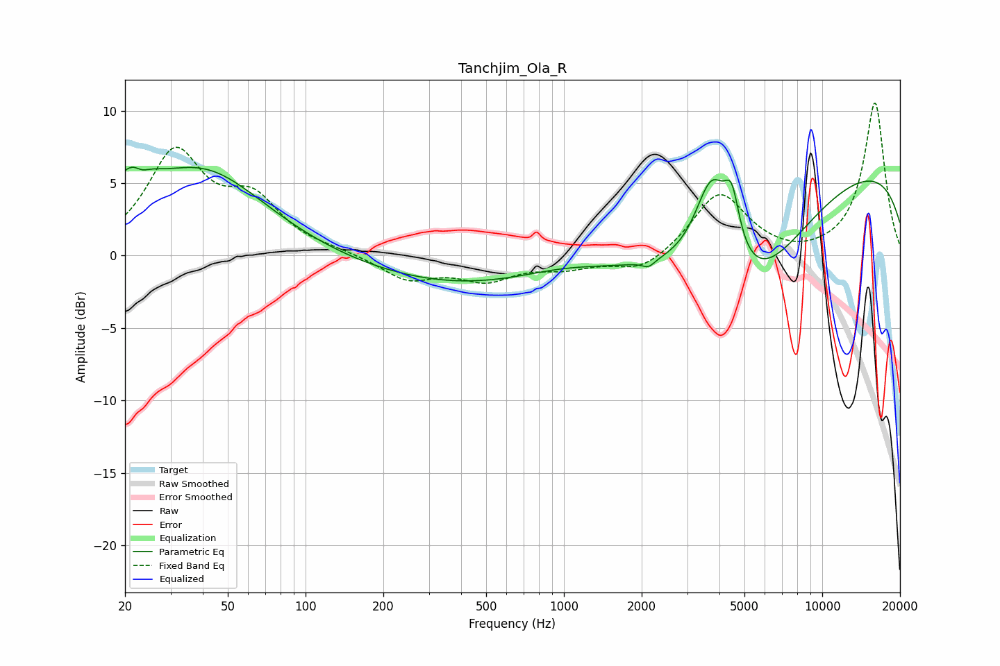

# Tanchjim_Ola_R
See [usage instructions](https://github.com/jaakkopasanen/AutoEq#usage) for more options and info.

### Parametric EQs
Apply preamp of -6.2 dB when using parametric equalizer.

|   # | Type    |   Fc (Hz) |    Q |   Gain (dB) |
|-----|---------|-----------|------|-------------|
|   1 | Peaking |        21 | 1.79 |         2.9 |
|   2 | Peaking |        23 | 5.65 |        -0.4 |
|   3 | Peaking |        40 | 0.59 |         5.8 |
|   4 | Peaking |       892 | 0.18 |        -2.7 |
|   5 | Peaking |       992 | 0.7  |         1.1 |
|   6 | Peaking |      2126 | 5.84 |        -0.5 |
|   7 | Peaking |      3742 | 2.04 |         6.9 |
|   8 | Peaking |      4467 | 4.78 |         3.5 |
|   9 | Peaking |      5176 | 0.61 |        -7.5 |
|  10 | Peaking |     10000 | 0.18 |         6.7 |

### Fixed Band EQs
When using fixed band (also called graphic) equalizer, apply preamp of **-10.6 dB** (if available) and set gains manually with these parameters.

|   # | Type    |   Fc (Hz) |    Q |   Gain (dB) |
|-----|---------|-----------|------|-------------|
|   1 | Peaking |        31 | 1.41 |         6.9 |
|   2 | Peaking |        62 | 1.41 |         3.4 |
|   3 | Peaking |       125 | 1.41 |         0.2 |
|   4 | Peaking |       250 | 1.41 |        -1.6 |
|   5 | Peaking |       500 | 1.41 |        -1.5 |
|   6 | Peaking |      1000 | 1.41 |        -0.7 |
|   7 | Peaking |      2000 | 1.41 |        -1.2 |
|   8 | Peaking |      4000 | 1.41 |         4.4 |
|   9 | Peaking |      8000 | 1.41 |        -0.3 |
|  10 | Peaking |     16000 | 1.41 |        10.6 |

### Graphs

