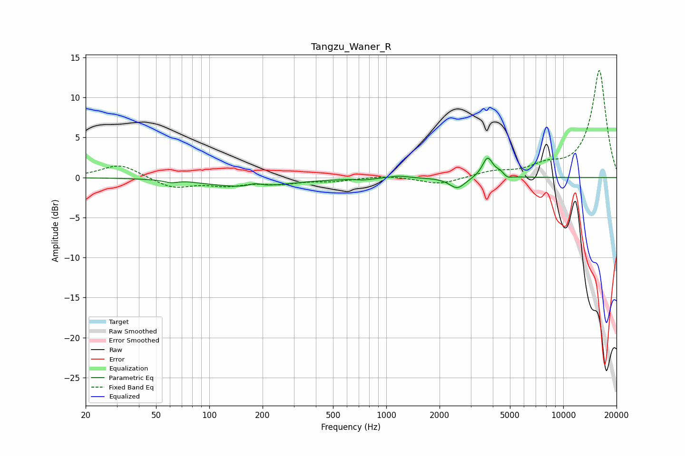

# Tangzu_Waner_R
See [usage instructions](https://github.com/jaakkopasanen/AutoEq#usage) for more options and info.

### Parametric EQs
Apply preamp of -2.5 dB when using parametric equalizer.

|   # | Type    |   Fc (Hz) |    Q |   Gain (dB) |
|-----|---------|-----------|------|-------------|
|   1 | Peaking |        60 | 4.05 |        -0.3 |
|   2 | Peaking |        75 | 2.7  |         0.1 |
|   3 | Peaking |       163 | 0.61 |        -1.2 |
|   4 | Peaking |       181 | 4.07 |         0.4 |
|   5 | Peaking |       751 | 3.28 |        -0.2 |
|   6 | Peaking |      1177 | 2.98 |         0.3 |
|   7 | Peaking |      2524 | 3.18 |        -1.4 |
|   8 | Peaking |      3739 | 4.73 |         2.5 |
|   9 | Peaking |      4407 | 6    |         0.5 |
|  10 | Peaking |      4814 | 6    |        -0.4 |

### Fixed Band EQs
When using fixed band (also called graphic) equalizer, apply preamp of **-13.5 dB** (if available) and set gains manually with these parameters.

|   # | Type    |   Fc (Hz) |    Q |   Gain (dB) |
|-----|---------|-----------|------|-------------|
|   1 | Peaking |        31 | 1.41 |         1.7 |
|   2 | Peaking |        62 | 1.41 |        -1.3 |
|   3 | Peaking |       125 | 1.41 |        -0.9 |
|   4 | Peaking |       250 | 1.41 |        -0.7 |
|   5 | Peaking |       500 | 1.41 |        -0.4 |
|   6 | Peaking |      1000 | 1.41 |         0.3 |
|   7 | Peaking |      2000 | 1.41 |        -0.9 |
|   8 | Peaking |      4000 | 1.41 |         0.7 |
|   9 | Peaking |      8000 | 1.41 |         1.2 |
|  10 | Peaking |     16000 | 1.41 |        13.4 |

### Graphs

