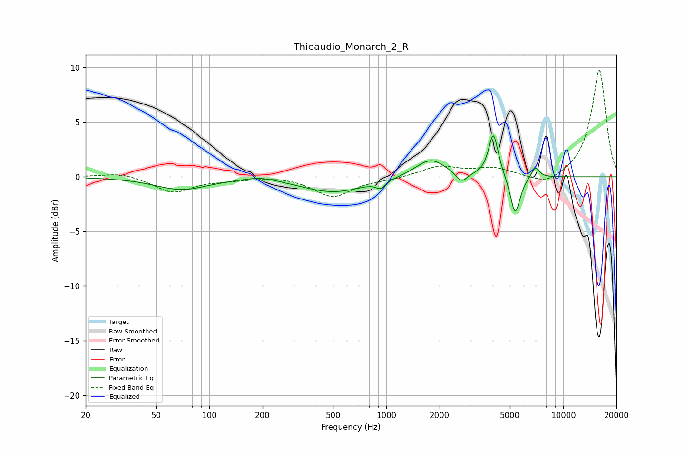

# Thieaudio_Monarch_2_R
See [usage instructions](https://github.com/jaakkopasanen/AutoEq#usage) for more options and info.

### Parametric EQs
Apply preamp of -3.9 dB when using parametric equalizer.

|   # | Type    |   Fc (Hz) |    Q |   Gain (dB) |
|-----|---------|-----------|------|-------------|
|   1 | Peaking |        70 | 0.96 |        -1.1 |
|   2 | Peaking |       195 | 1.56 |         0.4 |
|   3 | Peaking |       504 | 0.78 |        -1.4 |
|   4 | Peaking |       928 | 5.36 |        -0.6 |
|   5 | Peaking |      1777 | 1.67 |         1.7 |
|   6 | Peaking |      2666 | 4.53 |        -0.9 |
|   7 | Peaking |      4022 | 5.71 |         3.4 |
|   8 | Peaking |      4136 | 3.22 |         0.7 |
|   9 | Peaking |      5349 | 4.97 |        -3.6 |
|  10 | Peaking |      6954 | 5.99 |         1   |

### Fixed Band EQs
When using fixed band (also called graphic) equalizer, apply preamp of **-9.8 dB** (if available) and set gains manually with these parameters.

|   # | Type    |   Fc (Hz) |    Q |   Gain (dB) |
|-----|---------|-----------|------|-------------|
|   1 | Peaking |        31 | 1.41 |         0.4 |
|   2 | Peaking |        62 | 1.41 |        -1.4 |
|   3 | Peaking |       125 | 1.41 |        -0.2 |
|   4 | Peaking |       250 | 1.41 |         0.1 |
|   5 | Peaking |       500 | 1.41 |        -1.8 |
|   6 | Peaking |      1000 | 1.41 |        -0.2 |
|   7 | Peaking |      2000 | 1.41 |         0.9 |
|   8 | Peaking |      4000 | 1.41 |         0.7 |
|   9 | Peaking |      8000 | 1.41 |        -0.9 |
|  10 | Peaking |     16000 | 1.41 |         9.8 |

### Graphs

