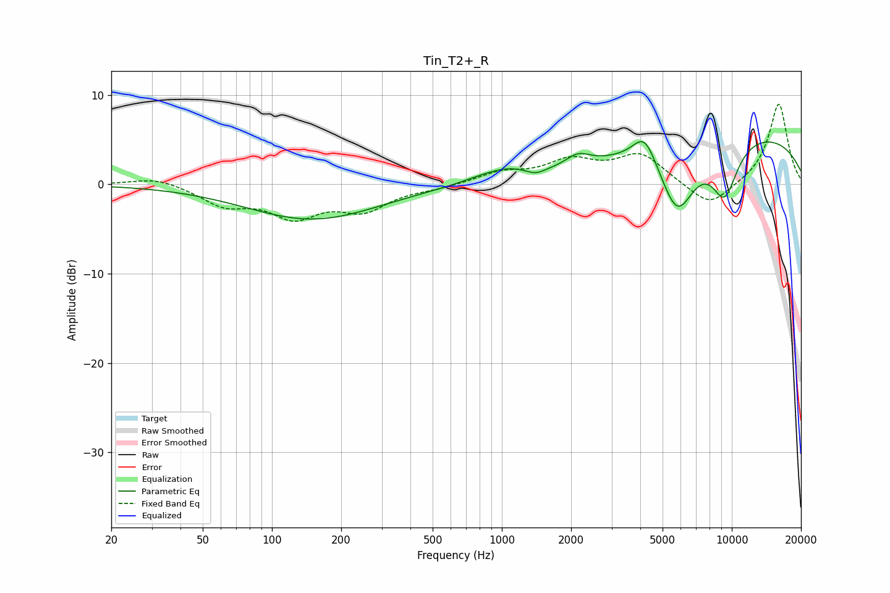

# Tin_T2+_R
See [usage instructions](https://github.com/jaakkopasanen/AutoEq#usage) for more options and info.

### Parametric EQs
Apply preamp of -4.9 dB when using parametric equalizer.

|   # | Type    |   Fc (Hz) |    Q |   Gain (dB) |
|-----|---------|-----------|------|-------------|
|   1 | Peaking |       150 | 0.49 |        -3.9 |
|   2 | Peaking |       835 | 1.25 |         0.6 |
|   3 | Peaking |      1078 | 1.48 |         1   |
|   4 | Peaking |      1401 | 3.35 |        -0.6 |
|   5 | Peaking |      2124 | 2.81 |         1.1 |
|   6 | Peaking |      2266 | 3.03 |         0.2 |
|   7 | Peaking |      4176 | 2.7  |         3.3 |
|   8 | Peaking |      5792 | 1.76 |        -7.7 |
|   9 | Peaking |      9310 | 2.16 |        -6   |
|  10 | Peaking |     10000 | 0.23 |         6   |

### Fixed Band EQs
When using fixed band (also called graphic) equalizer, apply preamp of **-9.0 dB** (if available) and set gains manually with these parameters.

|   # | Type    |   Fc (Hz) |    Q |   Gain (dB) |
|-----|---------|-----------|------|-------------|
|   1 | Peaking |        31 | 1.41 |         0.9 |
|   2 | Peaking |        62 | 1.41 |        -2.1 |
|   3 | Peaking |       125 | 1.41 |        -3.3 |
|   4 | Peaking |       250 | 1.41 |        -2.6 |
|   5 | Peaking |       500 | 1.41 |        -0.4 |
|   6 | Peaking |      1000 | 1.41 |         1.2 |
|   7 | Peaking |      2000 | 1.41 |         2.4 |
|   8 | Peaking |      4000 | 1.41 |         3.2 |
|   9 | Peaking |      8000 | 1.41 |        -2.8 |
|  10 | Peaking |     16000 | 1.41 |         9.1 |

### Graphs

