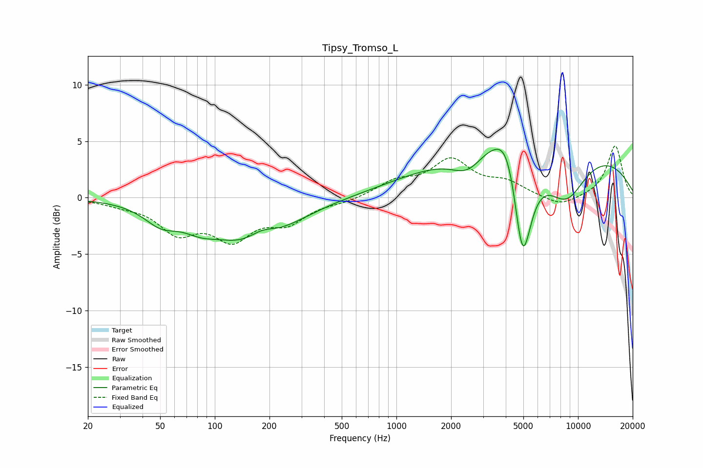

# Tipsy_Tromso_L
See [usage instructions](https://github.com/jaakkopasanen/AutoEq#usage) for more options and info.

### Parametric EQs
Apply preamp of -4.4 dB when using parametric equalizer.

|   # | Type    |   Fc (Hz) |    Q |   Gain (dB) |
|-----|---------|-----------|------|-------------|
|   1 | Peaking |        51 | 1.51 |        -1.6 |
|   2 | Peaking |        83 | 1.48 |        -1   |
|   3 | Peaking |       162 | 0.67 |        -4.2 |
|   4 | Peaking |       181 | 1.74 |         1.3 |
|   5 | Peaking |      2466 | 1.6  |        -1.7 |
|   6 | Peaking |      3201 | 1.62 |         0.7 |
|   7 | Peaking |      4109 | 2.04 |         3.5 |
|   8 | Peaking |      4949 | 2.71 |        -9.8 |
|   9 | Peaking |      6344 | 0.18 |         4.9 |
|  10 | Peaking |      8580 | 1.13 |        -4.3 |

### Fixed Band EQs
When using fixed band (also called graphic) equalizer, apply preamp of **-4.7 dB** (if available) and set gains manually with these parameters.

|   # | Type    |   Fc (Hz) |    Q |   Gain (dB) |
|-----|---------|-----------|------|-------------|
|   1 | Peaking |        31 | 1.41 |        -0.4 |
|   2 | Peaking |        62 | 1.41 |        -2.8 |
|   3 | Peaking |       125 | 1.41 |        -3.3 |
|   4 | Peaking |       250 | 1.41 |        -1.9 |
|   5 | Peaking |       500 | 1.41 |        -0.3 |
|   6 | Peaking |      1000 | 1.41 |         1.3 |
|   7 | Peaking |      2000 | 1.41 |         3.1 |
|   8 | Peaking |      4000 | 1.41 |         1.2 |
|   9 | Peaking |      8000 | 1.41 |        -0.9 |
|  10 | Peaking |     16000 | 1.41 |         4.6 |

### Graphs

