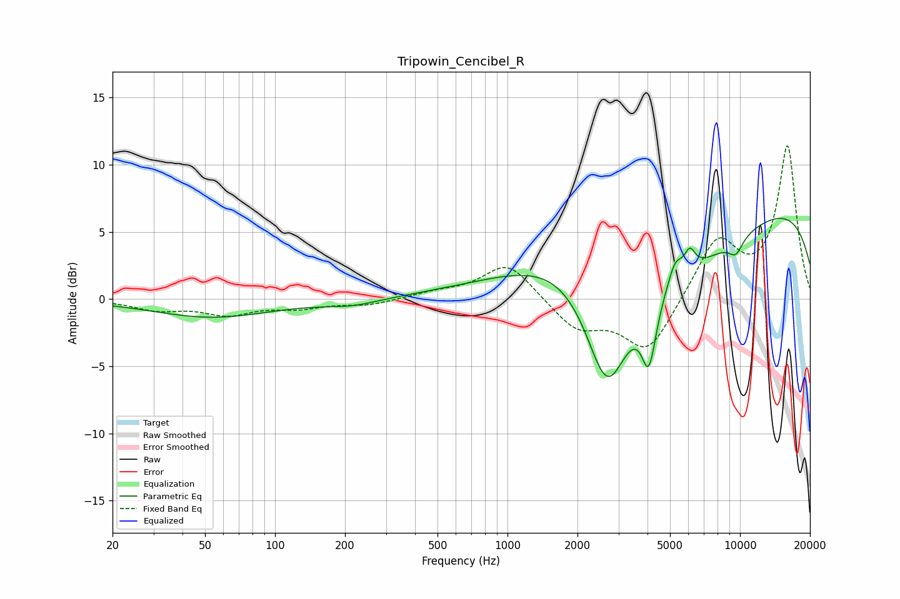

# Tripowin_Cencibel_R
See [usage instructions](https://github.com/jaakkopasanen/AutoEq#usage) for more options and info.

### Parametric EQs
Apply preamp of -6.1 dB when using parametric equalizer.

|   # | Type    |   Fc (Hz) |    Q |   Gain (dB) |
|-----|---------|-----------|------|-------------|
|   1 | Peaking |        53 | 0.56 |        -1.3 |
|   2 | Peaking |       215 | 1.22 |        -0.5 |
|   3 | Peaking |      2410 | 0.42 |        10.3 |
|   4 | Peaking |      2680 | 1.27 |       -11.3 |
|   5 | Peaking |      4057 | 4.51 |        -4.7 |
|   6 | Peaking |      4947 | 0.28 |       -12.6 |
|   7 | Peaking |      5254 | 4.61 |         1.6 |
|   8 | Peaking |      6081 | 5.82 |         1.5 |
|   9 | Peaking |      9593 | 4.06 |        -1.2 |
|  10 | Peaking |      9831 | 0.24 |        12.2 |

### Fixed Band EQs
When using fixed band (also called graphic) equalizer, apply preamp of **-11.5 dB** (if available) and set gains manually with these parameters.

|   # | Type    |   Fc (Hz) |    Q |   Gain (dB) |
|-----|---------|-----------|------|-------------|
|   1 | Peaking |        31 | 1.41 |        -0.7 |
|   2 | Peaking |        62 | 1.41 |        -1   |
|   3 | Peaking |       125 | 1.41 |        -0.6 |
|   4 | Peaking |       250 | 1.41 |        -0.4 |
|   5 | Peaking |       500 | 1.41 |         0.4 |
|   6 | Peaking |      1000 | 1.41 |         2.8 |
|   7 | Peaking |      2000 | 1.41 |        -2.2 |
|   8 | Peaking |      4000 | 1.41 |        -4   |
|   9 | Peaking |      8000 | 1.41 |         4.4 |
|  10 | Peaking |     16000 | 1.41 |        11.3 |

### Graphs

