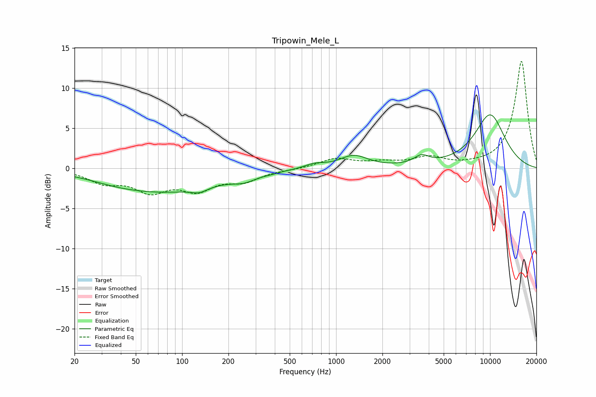

# Tripowin_Mele_L
See [usage instructions](https://github.com/jaakkopasanen/AutoEq#usage) for more options and info.

### Parametric EQs
Apply preamp of -6.7 dB when using parametric equalizer.

|   # | Type    |   Fc (Hz) |    Q |   Gain (dB) |
|-----|---------|-----------|------|-------------|
|   1 | Peaking |        37 | 0.94 |        -0.3 |
|   2 | Peaking |        75 | 0.4  |        -2.8 |
|   3 | Peaking |       129 | 2.68 |        -0.6 |
|   4 | Peaking |       253 | 1.82 |        -0.7 |
|   5 | Peaking |       382 | 3.23 |        -0.1 |
|   6 | Peaking |       722 | 2.27 |         0.5 |
|   7 | Peaking |      1303 | 1.55 |         1.5 |
|   8 | Peaking |      3588 | 2.86 |         1.1 |
|   9 | Peaking |     10000 | 1.17 |         6.6 |
|  10 | Peaking |     10000 | 3.79 |        -0   |

### Fixed Band EQs
When using fixed band (also called graphic) equalizer, apply preamp of **-13.4 dB** (if available) and set gains manually with these parameters.

|   # | Type    |   Fc (Hz) |    Q |   Gain (dB) |
|-----|---------|-----------|------|-------------|
|   1 | Peaking |        31 | 1.41 |        -1.6 |
|   2 | Peaking |        62 | 1.41 |        -2.6 |
|   3 | Peaking |       125 | 1.41 |        -2.4 |
|   4 | Peaking |       250 | 1.41 |        -1.4 |
|   5 | Peaking |       500 | 1.41 |        -0.1 |
|   6 | Peaking |      1000 | 1.41 |         1.2 |
|   7 | Peaking |      2000 | 1.41 |         0.6 |
|   8 | Peaking |      4000 | 1.41 |         1.2 |
|   9 | Peaking |      8000 | 1.41 |         0.2 |
|  10 | Peaking |     16000 | 1.41 |        13.4 |

### Graphs

