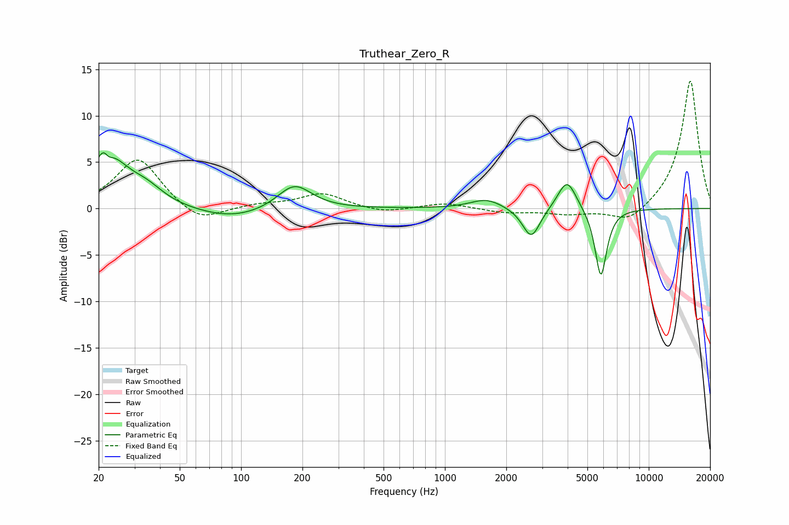

# Truthear_Zero_R
See [usage instructions](https://github.com/jaakkopasanen/AutoEq#usage) for more options and info.

### Parametric EQs
Apply preamp of -6.1 dB when using parametric equalizer.

|   # | Type    |   Fc (Hz) |    Q |   Gain (dB) |
|-----|---------|-----------|------|-------------|
|   1 | Peaking |        21 | 5.68 |         3.4 |
|   2 | Peaking |        22 | 5.35 |        -3.2 |
|   3 | Peaking |        22 | 1.51 |         5.4 |
|   4 | Peaking |        34 | 1.66 |         1.5 |
|   5 | Peaking |        91 | 0.8  |        -1.2 |
|   6 | Peaking |       183 | 1.68 |         2.8 |
|   7 | Peaking |      1598 | 1.83 |         1   |
|   8 | Peaking |      2653 | 3.29 |        -3.3 |
|   9 | Peaking |      3973 | 3.08 |         3.3 |
|  10 | Peaking |      5822 | 4.82 |        -7.5 |

### Fixed Band EQs
When using fixed band (also called graphic) equalizer, apply preamp of **-13.8 dB** (if available) and set gains manually with these parameters.

|   # | Type    |   Fc (Hz) |    Q |   Gain (dB) |
|-----|---------|-----------|------|-------------|
|   1 | Peaking |        31 | 1.41 |         5.5 |
|   2 | Peaking |        62 | 1.41 |        -1.8 |
|   3 | Peaking |       125 | 1.41 |         0.4 |
|   4 | Peaking |       250 | 1.41 |         1.6 |
|   5 | Peaking |       500 | 1.41 |        -0.5 |
|   6 | Peaking |      1000 | 1.41 |         0.6 |
|   7 | Peaking |      2000 | 1.41 |        -0.5 |
|   8 | Peaking |      4000 | 1.41 |        -0.6 |
|   9 | Peaking |      8000 | 1.41 |        -1.7 |
|  10 | Peaking |     16000 | 1.41 |        13.9 |

### Graphs

