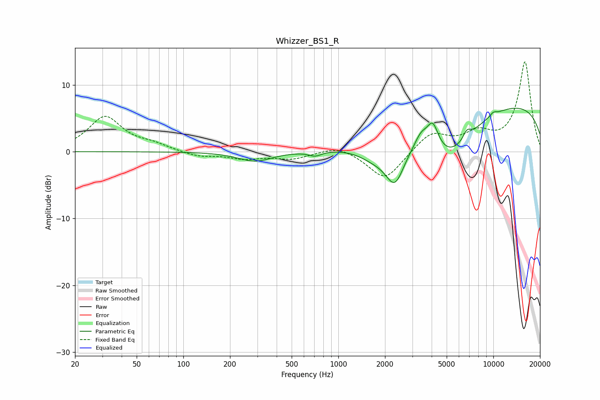

# Whizzer_BS1_R
See [usage instructions](https://github.com/jaakkopasanen/AutoEq#usage) for more options and info.

### Parametric EQs
Apply preamp of -6.6 dB when using parametric equalizer.

|   # | Type    |   Fc (Hz) |    Q |   Gain (dB) |
|-----|---------|-----------|------|-------------|
|   1 | Peaking |       291 | 1.3  |        -1.5 |
|   2 | Peaking |       709 | 3.42 |        -0.7 |
|   3 | Peaking |      1717 | 1.32 |        -2.1 |
|   4 | Peaking |      2319 | 2.27 |        -5.8 |
|   5 | Peaking |      3417 | 3.42 |         2   |
|   6 | Peaking |      4065 | 3.79 |         3.8 |
|   7 | Peaking |      5216 | 0.81 |        -6.7 |
|   8 | Peaking |      6751 | 5.47 |         1.3 |
|   9 | Peaking |     10000 | 0.18 |         7.6 |
|  10 | Peaking |     10000 | 5.85 |         0.5 |

### Fixed Band EQs
When using fixed band (also called graphic) equalizer, apply preamp of **-13.5 dB** (if available) and set gains manually with these parameters.

|   # | Type    |   Fc (Hz) |    Q |   Gain (dB) |
|-----|---------|-----------|------|-------------|
|   1 | Peaking |        31 | 1.41 |         5.2 |
|   2 | Peaking |        62 | 1.41 |         0.9 |
|   3 | Peaking |       125 | 1.41 |        -0.7 |
|   4 | Peaking |       250 | 1.41 |        -1   |
|   5 | Peaking |       500 | 1.41 |        -1   |
|   6 | Peaking |      1000 | 1.41 |         1   |
|   7 | Peaking |      2000 | 1.41 |        -4.3 |
|   8 | Peaking |      4000 | 1.41 |         2.8 |
|   9 | Peaking |      8000 | 1.41 |         2.4 |
|  10 | Peaking |     16000 | 1.41 |        13.4 |

### Graphs

