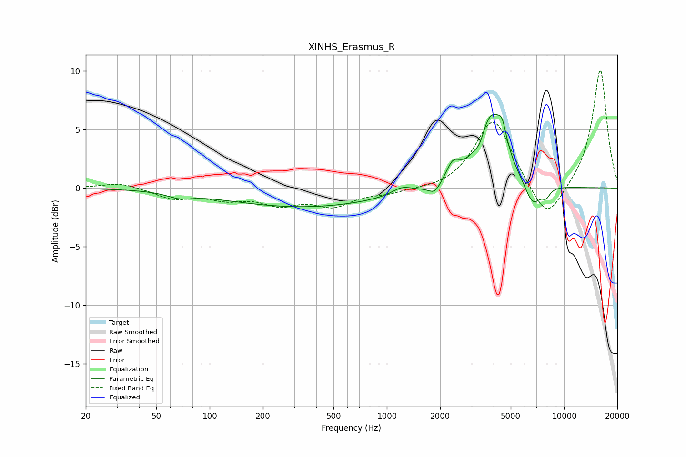

# XINHS_Erasmus_R
See [usage instructions](https://github.com/jaakkopasanen/AutoEq#usage) for more options and info.

### Parametric EQs
Apply preamp of -6.4 dB when using parametric equalizer.

|   # | Type    |   Fc (Hz) |    Q |   Gain (dB) |
|-----|---------|-----------|------|-------------|
|   1 | Peaking |        68 | 2.09 |        -0.4 |
|   2 | Peaking |       343 | 0.32 |        -1.6 |
|   3 | Peaking |      1214 | 2.52 |         0.6 |
|   4 | Peaking |      1867 | 3.92 |        -0.9 |
|   5 | Peaking |      2358 | 3.5  |         1.5 |
|   6 | Peaking |      3345 | 5.95 |        -0.7 |
|   7 | Peaking |      3892 | 1.84 |         6.2 |
|   8 | Peaking |      4477 | 6    |         1.6 |
|   9 | Peaking |      6651 | 2.9  |        -2.1 |
|  10 | Peaking |      7918 | 6    |        -0.7 |

### Fixed Band EQs
When using fixed band (also called graphic) equalizer, apply preamp of **-10.1 dB** (if available) and set gains manually with these parameters.

|   # | Type    |   Fc (Hz) |    Q |   Gain (dB) |
|-----|---------|-----------|------|-------------|
|   1 | Peaking |        31 | 1.41 |         0.5 |
|   2 | Peaking |        62 | 1.41 |        -0.9 |
|   3 | Peaking |       125 | 1.41 |        -0.8 |
|   4 | Peaking |       250 | 1.41 |        -1.2 |
|   5 | Peaking |       500 | 1.41 |        -1.4 |
|   6 | Peaking |      1000 | 1.41 |        -0.4 |
|   7 | Peaking |      2000 | 1.41 |        -0.2 |
|   8 | Peaking |      4000 | 1.41 |         6   |
|   9 | Peaking |      8000 | 1.41 |        -3.2 |
|  10 | Peaking |     16000 | 1.41 |        10.2 |

### Graphs

