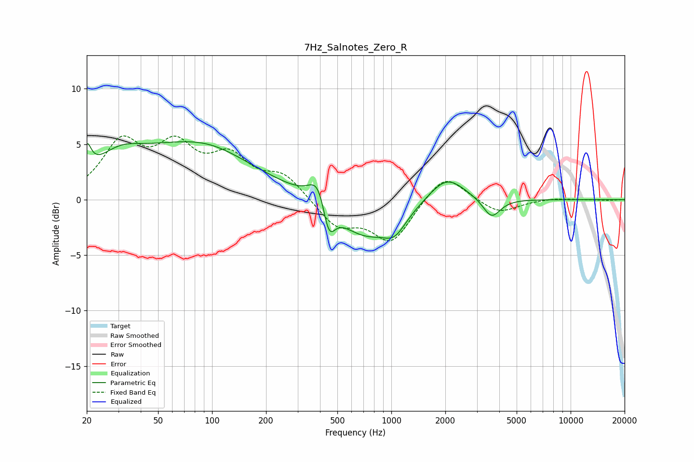

# 7Hz_Salnotes_Zero_R
See [usage instructions](https://github.com/jaakkopasanen/AutoEq#usage) for more options and info.

### Parametric EQs
Apply preamp of -5.3 dB when using parametric equalizer.

|   # | Type    |   Fc (Hz) |    Q |   Gain (dB) |
|-----|---------|-----------|------|-------------|
|   1 | Peaking |        20 | 5.93 |         2.3 |
|   2 | Peaking |        30 | 1.15 |         1.8 |
|   3 | Peaking |        73 | 0.38 |         4.6 |
|   4 | Peaking |        99 | 0.91 |         0.5 |
|   5 | Peaking |       396 | 2.66 |         3   |
|   6 | Peaking |       446 | 3.96 |        -3.5 |
|   7 | Peaking |       705 | 0.87 |        -3.4 |
|   8 | Peaking |      1046 | 2.24 |        -1.6 |
|   9 | Peaking |      2034 | 1.41 |         2.4 |
|  10 | Peaking |      3624 | 2.92 |        -1.8 |

### Fixed Band EQs
When using fixed band (also called graphic) equalizer, apply preamp of **-5.8 dB** (if available) and set gains manually with these parameters.

|   # | Type    |   Fc (Hz) |    Q |   Gain (dB) |
|-----|---------|-----------|------|-------------|
|   1 | Peaking |        31 | 1.41 |         4.8 |
|   2 | Peaking |        62 | 1.41 |         4.2 |
|   3 | Peaking |       125 | 1.41 |         3.3 |
|   4 | Peaking |       250 | 1.41 |         2   |
|   5 | Peaking |       500 | 1.41 |        -2.4 |
|   6 | Peaking |      1000 | 1.41 |        -3.8 |
|   7 | Peaking |      2000 | 1.41 |         2.6 |
|   8 | Peaking |      4000 | 1.41 |        -1.3 |
|   9 | Peaking |      8000 | 1.41 |         0.2 |
|  10 | Peaking |     16000 | 1.41 |        -0.1 |

### Graphs

