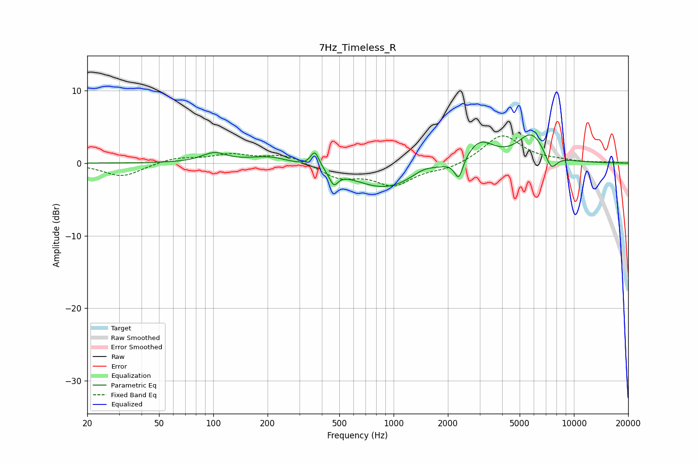

# 7Hz_Timeless_R
See [usage instructions](https://github.com/jaakkopasanen/AutoEq#usage) for more options and info.

### Parametric EQs
Apply preamp of -4.0 dB when using parametric equalizer.

|   # | Type    |   Fc (Hz) |    Q |   Gain (dB) |
|-----|---------|-----------|------|-------------|
|   1 | Peaking |       101 | 2.05 |         1.3 |
|   2 | Peaking |       205 | 1.29 |         1   |
|   3 | Peaking |       366 | 6    |         2.2 |
|   4 | Peaking |       466 | 6    |        -1.8 |
|   5 | Peaking |       901 | 0.78 |        -3.5 |
|   6 | Peaking |      1465 | 2.19 |         0.9 |
|   7 | Peaking |      2299 | 6    |        -2.8 |
|   8 | Peaking |      3010 | 1.8  |         3.1 |
|   9 | Peaking |      5817 | 1.81 |         4   |
|  10 | Peaking |      7475 | 4.14 |        -2.3 |

### Fixed Band EQs
When using fixed band (also called graphic) equalizer, apply preamp of **-3.9 dB** (if available) and set gains manually with these parameters.

|   # | Type    |   Fc (Hz) |    Q |   Gain (dB) |
|-----|---------|-----------|------|-------------|
|   1 | Peaking |        31 | 1.41 |        -1.9 |
|   2 | Peaking |        62 | 1.41 |         0.8 |
|   3 | Peaking |       125 | 1.41 |         1.1 |
|   4 | Peaking |       250 | 1.41 |         1.2 |
|   5 | Peaking |       500 | 1.41 |        -1.9 |
|   6 | Peaking |      1000 | 1.41 |        -2.9 |
|   7 | Peaking |      2000 | 1.41 |        -0.8 |
|   8 | Peaking |      4000 | 1.41 |         3.9 |
|   9 | Peaking |      8000 | 1.41 |         0.3 |
|  10 | Peaking |     16000 | 1.41 |         0.1 |

### Graphs

