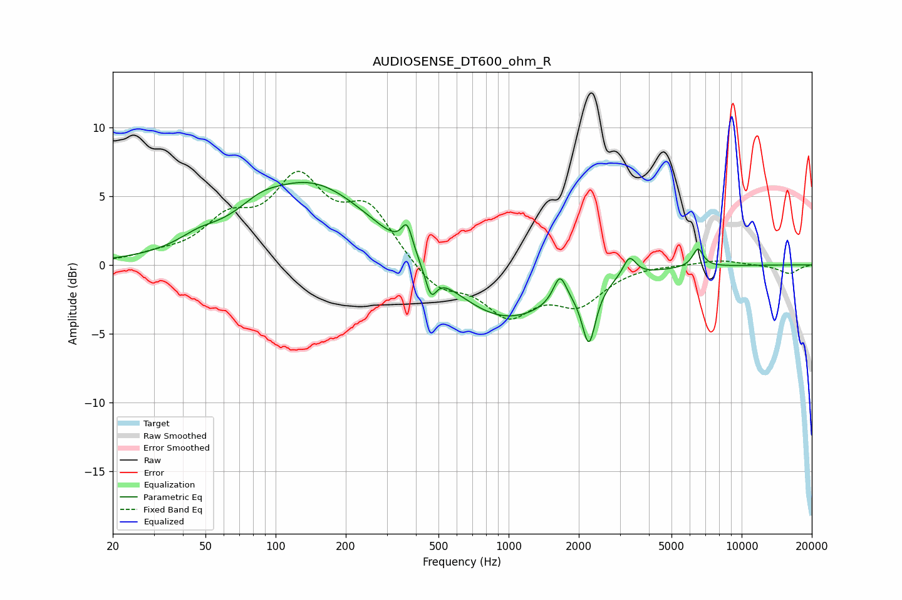

# AUDIOSENSE_DT600_ohm_R
See [usage instructions](https://github.com/jaakkopasanen/AutoEq#usage) for more options and info.

### Parametric EQs
Apply preamp of -6.1 dB when using parametric equalizer.

|   # | Type    |   Fc (Hz) |    Q |   Gain (dB) |
|-----|---------|-----------|------|-------------|
|   1 | Peaking |        46 | 1.86 |         0.6 |
|   2 | Peaking |        86 | 1.83 |         0.7 |
|   3 | Peaking |       142 | 0.53 |         6   |
|   4 | Peaking |       367 | 6    |         2   |
|   5 | Peaking |       464 | 6    |        -1.9 |
|   6 | Peaking |       953 | 0.6  |        -4.2 |
|   7 | Peaking |      1660 | 5.09 |         2   |
|   8 | Peaking |      2211 | 5.01 |        -4.2 |
|   9 | Peaking |      3298 | 5.09 |         1.5 |
|  10 | Peaking |      6493 | 6    |         1.4 |

### Fixed Band EQs
When using fixed band (also called graphic) equalizer, apply preamp of **-6.9 dB** (if available) and set gains manually with these parameters.

|   # | Type    |   Fc (Hz) |    Q |   Gain (dB) |
|-----|---------|-----------|------|-------------|
|   1 | Peaking |        31 | 1.41 |         0.5 |
|   2 | Peaking |        62 | 1.41 |         2.8 |
|   3 | Peaking |       125 | 1.41 |         5.7 |
|   4 | Peaking |       250 | 1.41 |         3.8 |
|   5 | Peaking |       500 | 1.41 |        -1.8 |
|   6 | Peaking |      1000 | 1.41 |        -3.3 |
|   7 | Peaking |      2000 | 1.41 |        -2.5 |
|   8 | Peaking |      4000 | 1.41 |         0.1 |
|   9 | Peaking |      8000 | 1.41 |         0.4 |
|  10 | Peaking |     16000 | 1.41 |        -0.6 |

### Graphs

