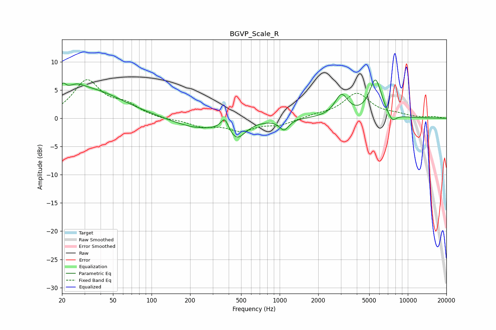

# BGVP_Scale_R
See [usage instructions](https://github.com/jaakkopasanen/AutoEq#usage) for more options and info.

### Parametric EQs
Apply preamp of -6.9 dB when using parametric equalizer.

|   # | Type    |   Fc (Hz) |    Q |   Gain (dB) |
|-----|---------|-----------|------|-------------|
|   1 | Peaking |        20 | 5.99 |         1.9 |
|   2 | Peaking |        25 | 2.02 |         1.6 |
|   3 | Peaking |        34 | 0.55 |         4.7 |
|   4 | Peaking |       227 | 0.73 |        -1.8 |
|   5 | Peaking |       373 | 4.62 |         2.4 |
|   6 | Peaking |       462 | 2.09 |        -3.1 |
|   7 | Peaking |      1083 | 3.97 |        -1.9 |
|   8 | Peaking |      3035 | 2.78 |         3.9 |
|   9 | Peaking |      5593 | 2.87 |         6.7 |
|  10 | Peaking |      7535 | 3.98 |        -1.6 |

### Fixed Band EQs
When using fixed band (also called graphic) equalizer, apply preamp of **-6.9 dB** (if available) and set gains manually with these parameters.

|   # | Type    |   Fc (Hz) |    Q |   Gain (dB) |
|-----|---------|-----------|------|-------------|
|   1 | Peaking |        31 | 1.41 |         6.5 |
|   2 | Peaking |        62 | 1.41 |         2   |
|   3 | Peaking |       125 | 1.41 |        -0.3 |
|   4 | Peaking |       250 | 1.41 |        -1.3 |
|   5 | Peaking |       500 | 1.41 |        -2   |
|   6 | Peaking |      1000 | 1.41 |        -1.1 |
|   7 | Peaking |      2000 | 1.41 |         0.5 |
|   8 | Peaking |      4000 | 1.41 |         4.3 |
|   9 | Peaking |      8000 | 1.41 |         0.5 |
|  10 | Peaking |     16000 | 1.41 |         0.2 |

### Graphs

