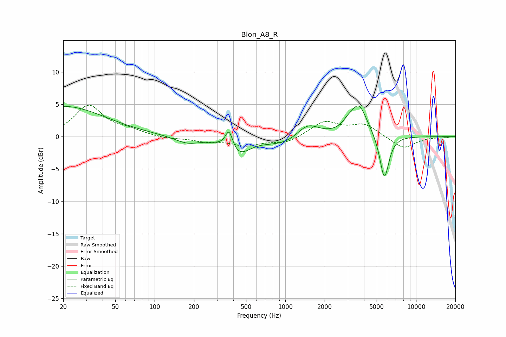

# Blon_A8_R
See [usage instructions](https://github.com/jaakkopasanen/AutoEq#usage) for more options and info.

### Parametric EQs
Apply preamp of -4.8 dB when using parametric equalizer.

|   # | Type    |   Fc (Hz) |    Q |   Gain (dB) |
|-----|---------|-----------|------|-------------|
|   1 | Peaking |        20 | 0.44 |         4.7 |
|   2 | Peaking |       178 | 1.44 |        -1.1 |
|   3 | Peaking |       371 | 4.96 |         3.1 |
|   4 | Peaking |       434 | 1.58 |        -2.8 |
|   5 | Peaking |       819 | 1.44 |        -0.7 |
|   6 | Peaking |      1064 | 1.82 |        -0.6 |
|   7 | Peaking |      1492 | 1.76 |         1.9 |
|   8 | Peaking |      2980 | 3.9  |         0.7 |
|   9 | Peaking |      3643 | 2.16 |         4.9 |
|  10 | Peaking |      5723 | 3.89 |        -7   |

### Fixed Band EQs
When using fixed band (also called graphic) equalizer, apply preamp of **-5.0 dB** (if available) and set gains manually with these parameters.

|   # | Type    |   Fc (Hz) |    Q |   Gain (dB) |
|-----|---------|-----------|------|-------------|
|   1 | Peaking |        31 | 1.41 |         4.7 |
|   2 | Peaking |        62 | 1.41 |         0.8 |
|   3 | Peaking |       125 | 1.41 |        -0.3 |
|   4 | Peaking |       250 | 1.41 |        -0.7 |
|   5 | Peaking |       500 | 1.41 |        -1.3 |
|   6 | Peaking |      1000 | 1.41 |        -1   |
|   7 | Peaking |      2000 | 1.41 |         2.3 |
|   8 | Peaking |      4000 | 1.41 |         1.8 |
|   9 | Peaking |      8000 | 1.41 |        -1.9 |
|  10 | Peaking |     16000 | 1.41 |        -0.1 |

### Graphs

