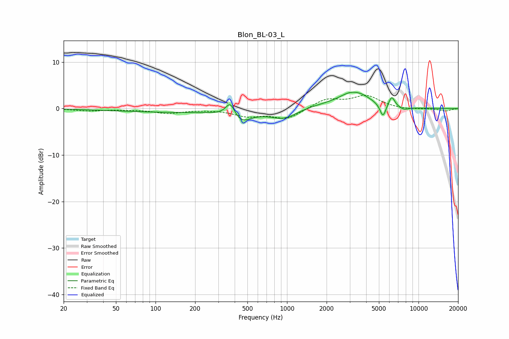

# Blon_BL-03_L
See [usage instructions](https://github.com/jaakkopasanen/AutoEq#usage) for more options and info.

### Parametric EQs
Apply preamp of -3.6 dB when using parametric equalizer.

|   # | Type    |   Fc (Hz) |    Q |   Gain (dB) |
|-----|---------|-----------|------|-------------|
|   1 | Peaking |       145 | 0.29 |        -0.8 |
|   2 | Peaking |       371 | 4.07 |         3.1 |
|   3 | Peaking |       446 | 1.91 |        -2.4 |
|   4 | Peaking |       948 | 1.32 |        -2.3 |
|   5 | Peaking |      1665 | 0.69 |         0.7 |
|   6 | Peaking |      3269 | 1.35 |         3.7 |
|   7 | Peaking |      3308 | 3.1  |        -0.4 |
|   8 | Peaking |      5365 | 6    |        -2.9 |
|   9 | Peaking |      6253 | 5.89 |         2.3 |
|  10 | Peaking |      7747 | 3.64 |        -0.6 |

### Fixed Band EQs
When using fixed band (also called graphic) equalizer, apply preamp of **-3.0 dB** (if available) and set gains manually with these parameters.

|   # | Type    |   Fc (Hz) |    Q |   Gain (dB) |
|-----|---------|-----------|------|-------------|
|   1 | Peaking |        31 | 1.41 |        -0.5 |
|   2 | Peaking |        62 | 1.41 |        -0.1 |
|   3 | Peaking |       125 | 1.41 |        -1   |
|   4 | Peaking |       250 | 1.41 |        -0.1 |
|   5 | Peaking |       500 | 1.41 |        -1.5 |
|   6 | Peaking |      1000 | 1.41 |        -2.2 |
|   7 | Peaking |      2000 | 1.41 |         2   |
|   8 | Peaking |      4000 | 1.41 |         2.6 |
|   9 | Peaking |      8000 | 1.41 |        -0.3 |
|  10 | Peaking |     16000 | 1.41 |        -0.5 |

### Graphs

