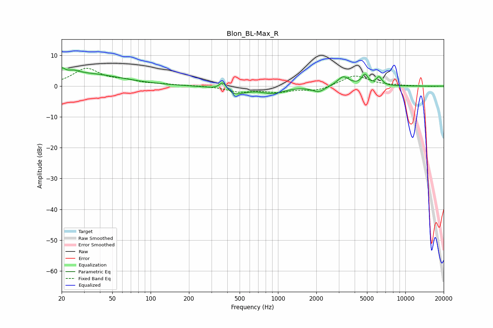

# Blon_BL-Max_R
See [usage instructions](https://github.com/jaakkopasanen/AutoEq#usage) for more options and info.

### Parametric EQs
Apply preamp of -6.0 dB when using parametric equalizer.

|   # | Type    |   Fc (Hz) |    Q |   Gain (dB) |
|-----|---------|-----------|------|-------------|
|   1 | Peaking |        20 | 5.51 |         2.4 |
|   2 | Peaking |        25 | 2.85 |         1.4 |
|   3 | Peaking |        32 | 0.53 |         3.8 |
|   4 | Peaking |       370 | 5.07 |         2.9 |
|   5 | Peaking |       451 | 1.66 |        -2.7 |
|   6 | Peaking |       909 | 1.59 |        -2.1 |
|   7 | Peaking |      2083 | 2.9  |        -1.9 |
|   8 | Peaking |      3258 | 3.11 |         3.1 |
|   9 | Peaking |      4812 | 5.67 |         3.4 |
|  10 | Peaking |      6218 | 6    |         2.7 |

### Fixed Band EQs
When using fixed band (also called graphic) equalizer, apply preamp of **-5.9 dB** (if available) and set gains manually with these parameters.

|   # | Type    |   Fc (Hz) |    Q |   Gain (dB) |
|-----|---------|-----------|------|-------------|
|   1 | Peaking |        31 | 1.41 |         5.5 |
|   2 | Peaking |        62 | 1.41 |         1.4 |
|   3 | Peaking |       125 | 1.41 |         0.4 |
|   4 | Peaking |       250 | 1.41 |         0.1 |
|   5 | Peaking |       500 | 1.41 |        -1.7 |
|   6 | Peaking |      1000 | 1.41 |        -1.7 |
|   7 | Peaking |      2000 | 1.41 |        -1.5 |
|   8 | Peaking |      4000 | 1.41 |         3.5 |
|   9 | Peaking |      8000 | 1.41 |         0.1 |
|  10 | Peaking |     16000 | 1.41 |        -0.1 |

### Graphs

