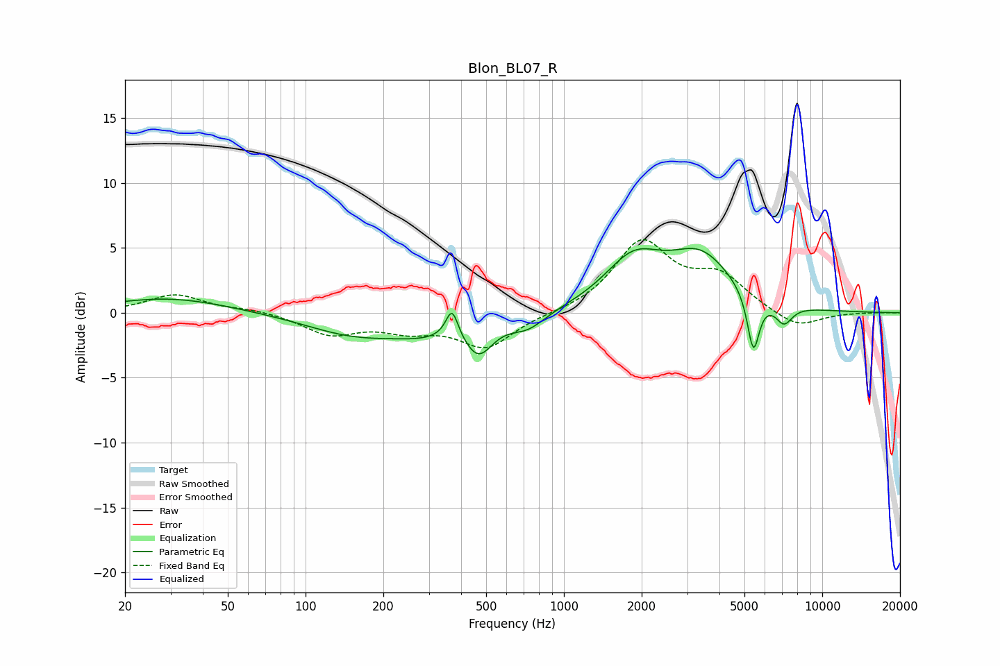

# Blon_BL07_R
See [usage instructions](https://github.com/jaakkopasanen/AutoEq#usage) for more options and info.

### Parametric EQs
Apply preamp of -5.0 dB when using parametric equalizer.

|   # | Type    |   Fc (Hz) |    Q |   Gain (dB) |
|-----|---------|-----------|------|-------------|
|   1 | Peaking |        30 | 0.62 |         1.2 |
|   2 | Peaking |       154 | 0.74 |        -1.6 |
|   3 | Peaking |       288 | 1.07 |        -1   |
|   4 | Peaking |       369 | 6    |         2.3 |
|   5 | Peaking |       468 | 2.57 |        -2.6 |
|   6 | Peaking |       724 | 2.01 |        -1.2 |
|   7 | Peaking |      1861 | 1.26 |         3.7 |
|   8 | Peaking |      3390 | 1.13 |         4   |
|   9 | Peaking |      5412 | 6    |        -4.5 |
|  10 | Peaking |      7108 | 4.11 |        -1.5 |

### Fixed Band EQs
When using fixed band (also called graphic) equalizer, apply preamp of **-5.7 dB** (if available) and set gains manually with these parameters.

|   # | Type    |   Fc (Hz) |    Q |   Gain (dB) |
|-----|---------|-----------|------|-------------|
|   1 | Peaking |        31 | 1.41 |         1.4 |
|   2 | Peaking |        62 | 1.41 |         0.3 |
|   3 | Peaking |       125 | 1.41 |        -1.6 |
|   4 | Peaking |       250 | 1.41 |        -1.1 |
|   5 | Peaking |       500 | 1.41 |        -2.6 |
|   6 | Peaking |      1000 | 1.41 |        -0.1 |
|   7 | Peaking |      2000 | 1.41 |         5.3 |
|   8 | Peaking |      4000 | 1.41 |         2.5 |
|   9 | Peaking |      8000 | 1.41 |        -1.3 |
|  10 | Peaking |     16000 | 1.41 |         0   |

### Graphs

