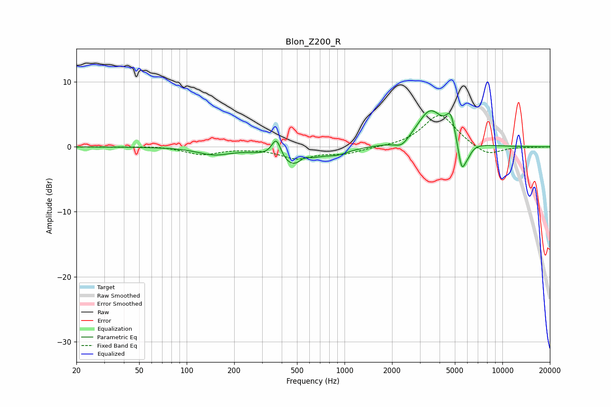

# Blon_Z200_R
See [usage instructions](https://github.com/jaakkopasanen/AutoEq#usage) for more options and info.

### Parametric EQs
Apply preamp of -5.6 dB when using parametric equalizer.

|   # | Type    |   Fc (Hz) |    Q |   Gain (dB) |
|-----|---------|-----------|------|-------------|
|   1 | Peaking |       148 | 1.4  |        -1.1 |
|   2 | Peaking |       370 | 4.65 |         3.2 |
|   3 | Peaking |       466 | 1.34 |        -3.2 |
|   4 | Peaking |       556 | 4.76 |         0.8 |
|   5 | Peaking |       902 | 1.98 |        -0.8 |
|   6 | Peaking |      2309 | 3.18 |        -1.2 |
|   7 | Peaking |      3491 | 1.69 |         5.6 |
|   8 | Peaking |      4704 | 4.83 |         3.5 |
|   9 | Peaking |      5516 | 5.76 |        -4.4 |
|  10 | Peaking |      6016 | 4.71 |        -1.5 |

### Fixed Band EQs
When using fixed band (also called graphic) equalizer, apply preamp of **-4.9 dB** (if available) and set gains manually with these parameters.

|   # | Type    |   Fc (Hz) |    Q |   Gain (dB) |
|-----|---------|-----------|------|-------------|
|   1 | Peaking |        31 | 1.41 |        -0   |
|   2 | Peaking |        62 | 1.41 |         0.2 |
|   3 | Peaking |       125 | 1.41 |        -1.2 |
|   4 | Peaking |       250 | 1.41 |        -0.1 |
|   5 | Peaking |       500 | 1.41 |        -1.7 |
|   6 | Peaking |      1000 | 1.41 |        -1   |
|   7 | Peaking |      2000 | 1.41 |        -0.1 |
|   8 | Peaking |      4000 | 1.41 |         5.1 |
|   9 | Peaking |      8000 | 1.41 |        -1.6 |
|  10 | Peaking |     16000 | 1.41 |        -0   |

### Graphs

