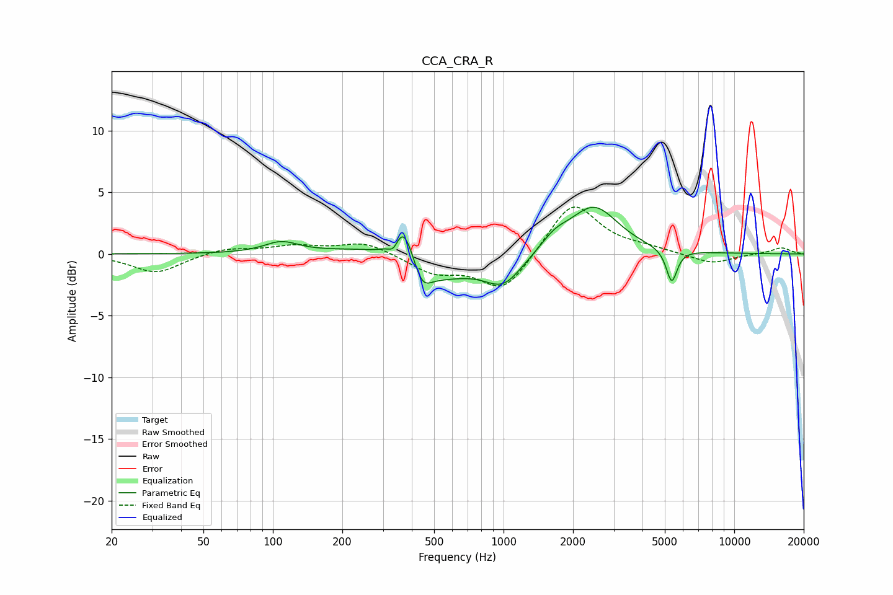

# CCA_CRA_R
See [usage instructions](https://github.com/jaakkopasanen/AutoEq#usage) for more options and info.

### Parametric EQs
Apply preamp of -3.9 dB when using parametric equalizer.

|   # | Type    |   Fc (Hz) |    Q |   Gain (dB) |
|-----|---------|-----------|------|-------------|
|   1 | Peaking |       109 | 1.94 |         0.9 |
|   2 | Peaking |       272 | 0.78 |         1.3 |
|   3 | Peaking |       335 | 6    |        -1.1 |
|   4 | Peaking |       366 | 2.91 |         3.9 |
|   5 | Peaking |       443 | 3.81 |        -1.7 |
|   6 | Peaking |       451 | 0.77 |        -2.8 |
|   7 | Peaking |      1000 | 1.76 |        -2.2 |
|   8 | Peaking |      1666 | 2.32 |         1   |
|   9 | Peaking |      2463 | 1.34 |         3.9 |
|  10 | Peaking |      5357 | 5.98 |        -2.7 |

### Fixed Band EQs
When using fixed band (also called graphic) equalizer, apply preamp of **-3.9 dB** (if available) and set gains manually with these parameters.

|   # | Type    |   Fc (Hz) |    Q |   Gain (dB) |
|-----|---------|-----------|------|-------------|
|   1 | Peaking |        31 | 1.41 |        -1.6 |
|   2 | Peaking |        62 | 1.41 |         0.5 |
|   3 | Peaking |       125 | 1.41 |         0.6 |
|   4 | Peaking |       250 | 1.41 |         1   |
|   5 | Peaking |       500 | 1.41 |        -1.4 |
|   6 | Peaking |      1000 | 1.41 |        -3.1 |
|   7 | Peaking |      2000 | 1.41 |         4.3 |
|   8 | Peaking |      4000 | 1.41 |         0.4 |
|   9 | Peaking |      8000 | 1.41 |        -0.8 |
|  10 | Peaking |     16000 | 1.41 |         0.5 |

### Graphs

