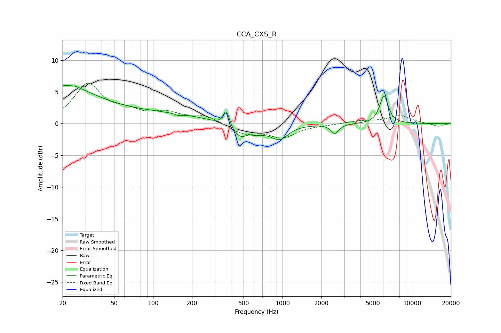

# CCA_CXS_R
See [usage instructions](https://github.com/jaakkopasanen/AutoEq#usage) for more options and info.

### Parametric EQs
Apply preamp of -6.1 dB when using parametric equalizer.

|   # | Type    |   Fc (Hz) |    Q |   Gain (dB) |
|-----|---------|-----------|------|-------------|
|   1 | Peaking |        20 | 0.57 |         5.6 |
|   2 | Peaking |        25 | 4.76 |         0.2 |
|   3 | Peaking |       116 | 0.31 |         1.5 |
|   4 | Peaking |       158 | 5.7  |        -0.3 |
|   5 | Peaking |       368 | 5.71 |         2.8 |
|   6 | Peaking |       506 | 1.43 |        -3.4 |
|   7 | Peaking |       545 | 3.46 |         1.1 |
|   8 | Peaking |       952 | 2.19 |        -2.1 |
|   9 | Peaking |      2539 | 4.71 |        -1.5 |
|  10 | Peaking |      6072 | 4.23 |         4.4 |

### Fixed Band EQs
When using fixed band (also called graphic) equalizer, apply preamp of **-6.5 dB** (if available) and set gains manually with these parameters.

|   # | Type    |   Fc (Hz) |    Q |   Gain (dB) |
|-----|---------|-----------|------|-------------|
|   1 | Peaking |        31 | 1.41 |         6   |
|   2 | Peaking |        62 | 1.41 |         1.5 |
|   3 | Peaking |       125 | 1.41 |         1.5 |
|   4 | Peaking |       250 | 1.41 |         1.2 |
|   5 | Peaking |       500 | 1.41 |        -1.5 |
|   6 | Peaking |      1000 | 1.41 |        -2   |
|   7 | Peaking |      2000 | 1.41 |        -0.1 |
|   8 | Peaking |      4000 | 1.41 |         0.4 |
|   9 | Peaking |      8000 | 1.41 |         1.2 |
|  10 | Peaking |     16000 | 1.41 |        -0.5 |

### Graphs

