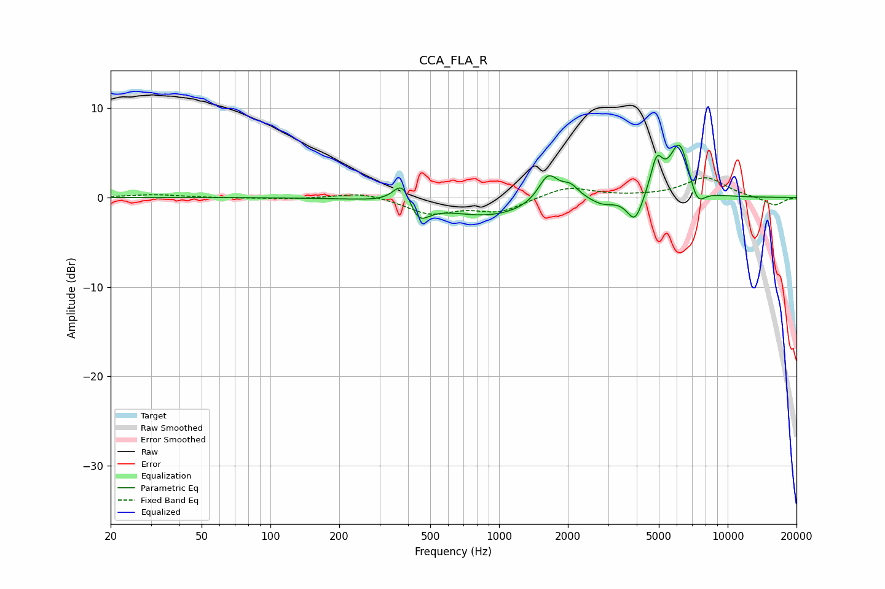

# CCA_FLA_R
See [usage instructions](https://github.com/jaakkopasanen/AutoEq#usage) for more options and info.

### Parametric EQs
Apply preamp of -6.0 dB when using parametric equalizer.

|   # | Type    |   Fc (Hz) |    Q |   Gain (dB) |
|-----|---------|-----------|------|-------------|
|   1 | Peaking |       380 | 3.53 |         3   |
|   2 | Peaking |       440 | 3.06 |        -2.6 |
|   3 | Peaking |       905 | 0.72 |        -2.1 |
|   4 | Peaking |      1639 | 3.3  |         3.1 |
|   5 | Peaking |      2046 | 3.53 |         1.5 |
|   6 | Peaking |      2846 | 2.79 |        -0.7 |
|   7 | Peaking |      3931 | 4.11 |        -3   |
|   8 | Peaking |      4891 | 5.15 |         3.7 |
|   9 | Peaking |      6163 | 3.09 |         6.2 |
|  10 | Peaking |      7350 | 3.98 |        -2.3 |

### Fixed Band EQs
When using fixed band (also called graphic) equalizer, apply preamp of **-2.3 dB** (if available) and set gains manually with these parameters.

|   # | Type    |   Fc (Hz) |    Q |   Gain (dB) |
|-----|---------|-----------|------|-------------|
|   1 | Peaking |        31 | 1.41 |         0.3 |
|   2 | Peaking |        62 | 1.41 |        -0.1 |
|   3 | Peaking |       125 | 1.41 |        -0.2 |
|   4 | Peaking |       250 | 1.41 |         0.6 |
|   5 | Peaking |       500 | 1.41 |        -1.7 |
|   6 | Peaking |      1000 | 1.41 |        -1.5 |
|   7 | Peaking |      2000 | 1.41 |         1.2 |
|   8 | Peaking |      4000 | 1.41 |         0   |
|   9 | Peaking |      8000 | 1.41 |         2.2 |
|  10 | Peaking |     16000 | 1.41 |        -0.9 |

### Graphs

