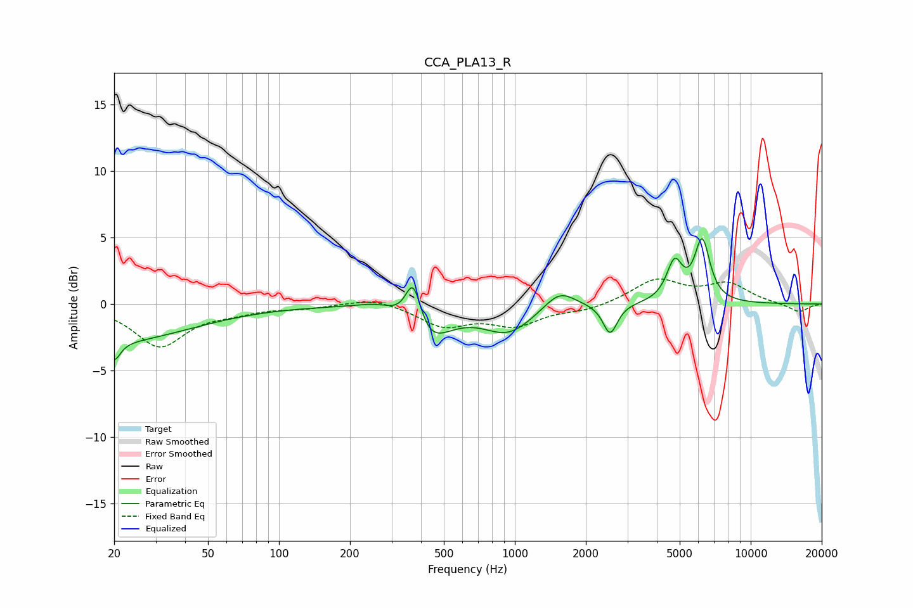

# CCA_PLA13_R
See [usage instructions](https://github.com/jaakkopasanen/AutoEq#usage) for more options and info.

### Parametric EQs
Apply preamp of -5.0 dB when using parametric equalizer.

|   # | Type    |   Fc (Hz) |    Q |   Gain (dB) |
|-----|---------|-----------|------|-------------|
|   1 | Peaking |        20 | 5.55 |        -1.4 |
|   2 | Peaking |        20 | 0.44 |        -2.8 |
|   3 | Peaking |       266 | 1.55 |         0.6 |
|   4 | Peaking |       371 | 4.13 |         3.7 |
|   5 | Peaking |       422 | 1.56 |        -3   |
|   6 | Peaking |       938 | 1.33 |        -2   |
|   7 | Peaking |      1547 | 2.14 |         1.4 |
|   8 | Peaking |      2535 | 4.69 |        -2.3 |
|   9 | Peaking |      4755 | 4.18 |         2.9 |
|  10 | Peaking |      6231 | 4.27 |         4.6 |

### Fixed Band EQs
When using fixed band (also called graphic) equalizer, apply preamp of **-2.0 dB** (if available) and set gains manually with these parameters.

|   # | Type    |   Fc (Hz) |    Q |   Gain (dB) |
|-----|---------|-----------|------|-------------|
|   1 | Peaking |        31 | 1.41 |        -3.1 |
|   2 | Peaking |        62 | 1.41 |        -0.5 |
|   3 | Peaking |       125 | 1.41 |        -0.3 |
|   4 | Peaking |       250 | 1.41 |         0.5 |
|   5 | Peaking |       500 | 1.41 |        -1.6 |
|   6 | Peaking |      1000 | 1.41 |        -1.5 |
|   7 | Peaking |      2000 | 1.41 |        -0.4 |
|   8 | Peaking |      4000 | 1.41 |         1.8 |
|   9 | Peaking |      8000 | 1.41 |         1.4 |
|  10 | Peaking |     16000 | 1.41 |        -0.6 |

### Graphs

