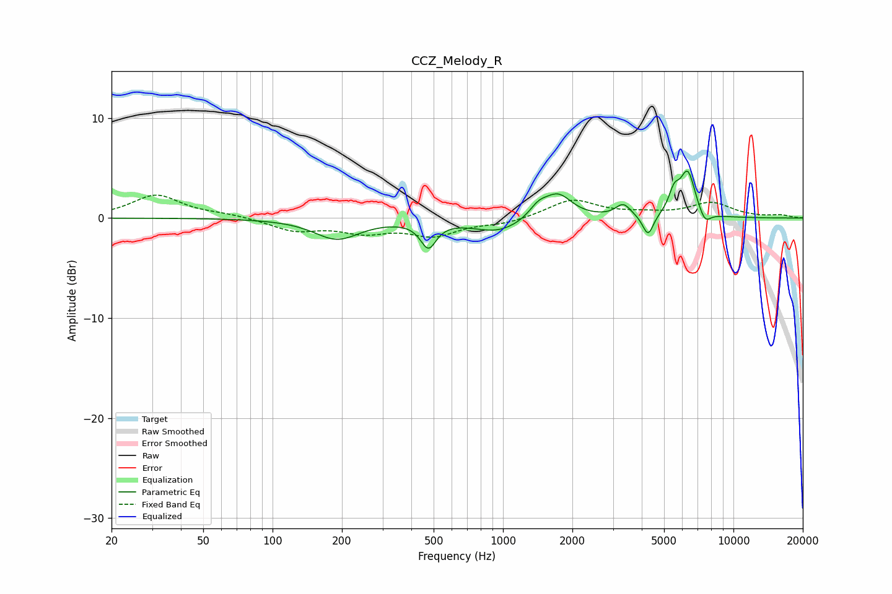

# CCZ_Melody_R
See [usage instructions](https://github.com/jaakkopasanen/AutoEq#usage) for more options and info.

### Parametric EQs
Apply preamp of -4.8 dB when using parametric equalizer.

|   # | Type    |   Fc (Hz) |    Q |   Gain (dB) |
|-----|---------|-----------|------|-------------|
|   1 | Peaking |       190 | 1.45 |        -2.1 |
|   2 | Peaking |       474 | 4.17 |        -2.6 |
|   3 | Peaking |       956 | 1.28 |        -1.4 |
|   4 | Peaking |      1426 | 3.46 |         1.1 |
|   5 | Peaking |      1734 | 2.35 |         2.4 |
|   6 | Peaking |      3327 | 4.35 |         1.3 |
|   7 | Peaking |      4262 | 6    |        -2.2 |
|   8 | Peaking |      5530 | 5.98 |         2   |
|   9 | Peaking |      6332 | 4.17 |         4.5 |
|  10 | Peaking |      7514 | 5.24 |        -1.3 |

### Fixed Band EQs
When using fixed band (also called graphic) equalizer, apply preamp of **-2.4 dB** (if available) and set gains manually with these parameters.

|   # | Type    |   Fc (Hz) |    Q |   Gain (dB) |
|-----|---------|-----------|------|-------------|
|   1 | Peaking |        31 | 1.41 |         2.3 |
|   2 | Peaking |        62 | 1.41 |         0.3 |
|   3 | Peaking |       125 | 1.41 |        -1.2 |
|   4 | Peaking |       250 | 1.41 |        -1.2 |
|   5 | Peaking |       500 | 1.41 |        -1.6 |
|   6 | Peaking |      1000 | 1.41 |        -0.5 |
|   7 | Peaking |      2000 | 1.41 |         1.8 |
|   8 | Peaking |      4000 | 1.41 |         0.3 |
|   9 | Peaking |      8000 | 1.41 |         1.5 |
|  10 | Peaking |     16000 | 1.41 |         0.3 |

### Graphs

