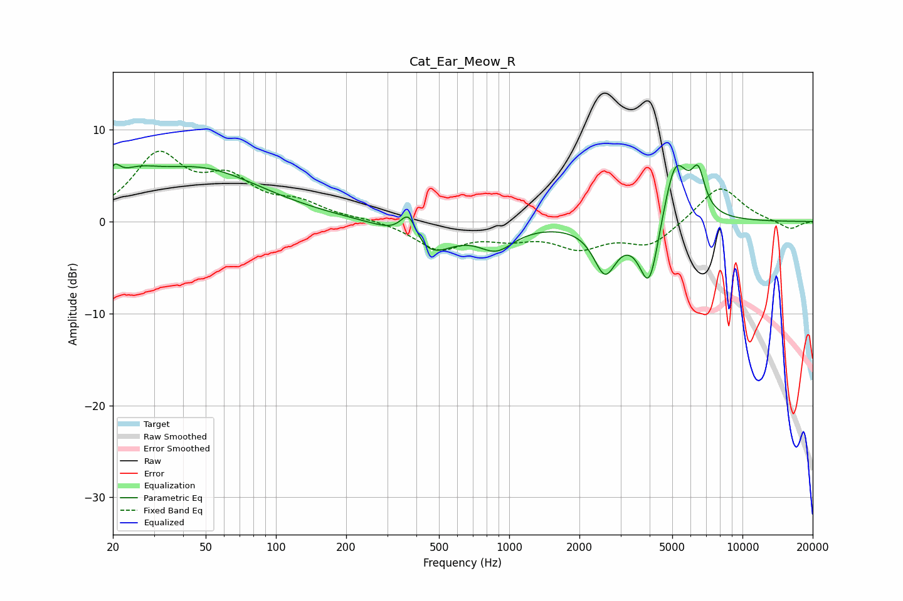

# Cat_Ear_Meow_R
See [usage instructions](https://github.com/jaakkopasanen/AutoEq#usage) for more options and info.

### Parametric EQs
Apply preamp of -6.3 dB when using parametric equalizer.

|   # | Type    |   Fc (Hz) |    Q |   Gain (dB) |
|-----|---------|-----------|------|-------------|
|   1 | Peaking |        20 | 5.67 |         2   |
|   2 | Peaking |        25 | 1.53 |         2.1 |
|   3 | Peaking |        47 | 0.53 |         5.5 |
|   4 | Peaking |       371 | 3.86 |         3.3 |
|   5 | Peaking |       444 | 1.37 |        -3.7 |
|   6 | Peaking |       880 | 1.86 |        -2.5 |
|   7 | Peaking |      2576 | 2.86 |        -5.2 |
|   8 | Peaking |      3989 | 3.11 |        -8.2 |
|   9 | Peaking |      5148 | 2.47 |         7.7 |
|  10 | Peaking |      6459 | 4.91 |         3.9 |

### Fixed Band EQs
When using fixed band (also called graphic) equalizer, apply preamp of **-7.8 dB** (if available) and set gains manually with these parameters.

|   # | Type    |   Fc (Hz) |    Q |   Gain (dB) |
|-----|---------|-----------|------|-------------|
|   1 | Peaking |        31 | 1.41 |         6.9 |
|   2 | Peaking |        62 | 1.41 |         3.9 |
|   3 | Peaking |       125 | 1.41 |         1.7 |
|   4 | Peaking |       250 | 1.41 |         0.3 |
|   5 | Peaking |       500 | 1.41 |        -2.9 |
|   6 | Peaking |      1000 | 1.41 |        -1.4 |
|   7 | Peaking |      2000 | 1.41 |        -2.5 |
|   8 | Peaking |      4000 | 1.41 |        -2.5 |
|   9 | Peaking |      8000 | 1.41 |         4   |
|  10 | Peaking |     16000 | 1.41 |        -0.9 |

### Graphs

