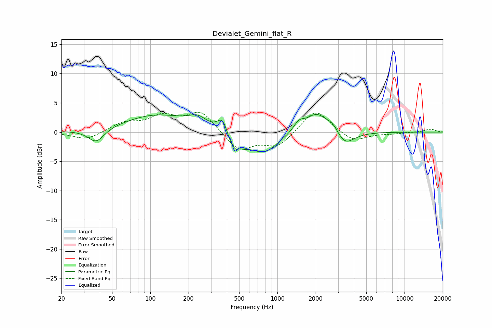

# Devialet_Gemini_flat_R
See [usage instructions](https://github.com/jaakkopasanen/AutoEq#usage) for more options and info.

### Parametric EQs
Apply preamp of -3.1 dB when using parametric equalizer.

|   # | Type    |   Fc (Hz) |    Q |   Gain (dB) |
|-----|---------|-----------|------|-------------|
|   1 | Peaking |        37 | 2.25 |        -2.4 |
|   2 | Peaking |       112 | 0.56 |         2.9 |
|   3 | Peaking |       237 | 1.91 |         1.7 |
|   4 | Peaking |       374 | 3.01 |         4.3 |
|   5 | Peaking |       440 | 1.8  |        -4.3 |
|   6 | Peaking |       792 | 1.33 |        -3.3 |
|   7 | Peaking |      1475 | 3.38 |         1.5 |
|   8 | Peaking |      2035 | 1.68 |         3.3 |
|   9 | Peaking |      2733 | 2.98 |         1.4 |
|  10 | Peaking |      3369 | 1.92 |        -2.6 |

### Fixed Band EQs
When using fixed band (also called graphic) equalizer, apply preamp of **-3.5 dB** (if available) and set gains manually with these parameters.

|   # | Type    |   Fc (Hz) |    Q |   Gain (dB) |
|-----|---------|-----------|------|-------------|
|   1 | Peaking |        31 | 1.41 |        -1.4 |
|   2 | Peaking |        62 | 1.41 |         1.5 |
|   3 | Peaking |       125 | 1.41 |         2.5 |
|   4 | Peaking |       250 | 1.41 |         3.5 |
|   5 | Peaking |       500 | 1.41 |        -3.2 |
|   6 | Peaking |      1000 | 1.41 |        -2.5 |
|   7 | Peaking |      2000 | 1.41 |         4.1 |
|   8 | Peaking |      4000 | 1.41 |        -1.7 |
|   9 | Peaking |      8000 | 1.41 |        -0.2 |
|  10 | Peaking |     16000 | 1.41 |         0.5 |

### Graphs

