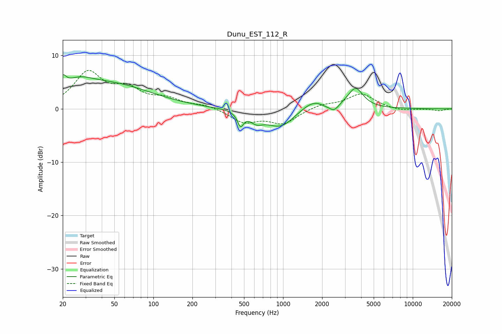

# Dunu_EST_112_R
See [usage instructions](https://github.com/jaakkopasanen/AutoEq#usage) for more options and info.

### Parametric EQs
Apply preamp of -6.5 dB when using parametric equalizer.

|   # | Type    |   Fc (Hz) |    Q |   Gain (dB) |
|-----|---------|-----------|------|-------------|
|   1 | Peaking |        20 | 5.55 |         2.2 |
|   2 | Peaking |        26 | 1.26 |         2.4 |
|   3 | Peaking |        47 | 0.44 |         4.4 |
|   4 | Peaking |       470 | 6    |        -2.5 |
|   5 | Peaking |       624 | 2.75 |        -1.6 |
|   6 | Peaking |       960 | 1.26 |        -3.6 |
|   7 | Peaking |      1879 | 1.27 |         3.5 |
|   8 | Peaking |      2083 | 1.84 |        -2   |
|   9 | Peaking |      2482 | 3.88 |        -1.3 |
|  10 | Peaking |      3624 | 2.46 |         3.6 |

### Fixed Band EQs
When using fixed band (also called graphic) equalizer, apply preamp of **-7.3 dB** (if available) and set gains manually with these parameters.

|   # | Type    |   Fc (Hz) |    Q |   Gain (dB) |
|-----|---------|-----------|------|-------------|
|   1 | Peaking |        31 | 1.41 |         6.6 |
|   2 | Peaking |        62 | 1.41 |         3.2 |
|   3 | Peaking |       125 | 1.41 |         1.6 |
|   4 | Peaking |       250 | 1.41 |         0.7 |
|   5 | Peaking |       500 | 1.41 |        -2.4 |
|   6 | Peaking |      1000 | 1.41 |        -2.6 |
|   7 | Peaking |      2000 | 1.41 |         0.8 |
|   8 | Peaking |      4000 | 1.41 |         2.8 |
|   9 | Peaking |      8000 | 1.41 |        -0.5 |
|  10 | Peaking |     16000 | 1.41 |        -0.4 |

### Graphs

