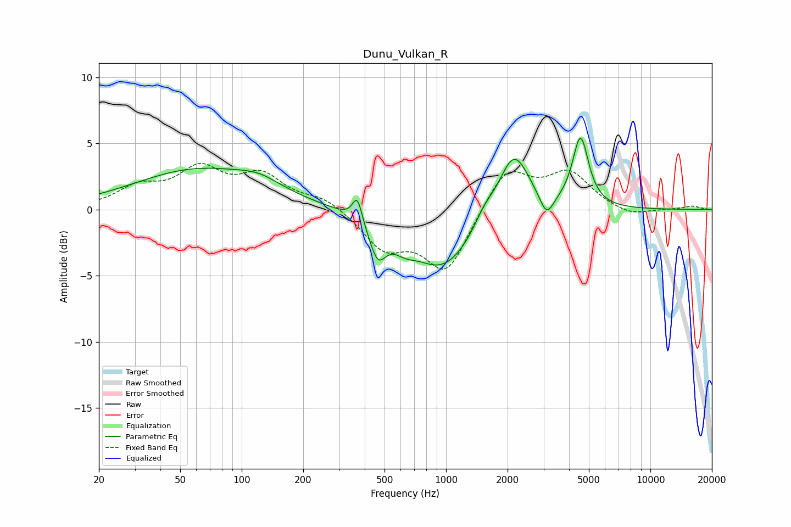

# Dunu_Vulkan_R
See [usage instructions](https://github.com/jaakkopasanen/AutoEq#usage) for more options and info.

### Parametric EQs
Apply preamp of -5.5 dB when using parametric equalizer.

|   # | Type    |   Fc (Hz) |    Q |   Gain (dB) |
|-----|---------|-----------|------|-------------|
|   1 | Peaking |        62 | 0.45 |         3   |
|   2 | Peaking |       122 | 1.37 |         0.8 |
|   3 | Peaking |       368 | 6    |         1.9 |
|   4 | Peaking |       463 | 3.41 |        -2.6 |
|   5 | Peaking |       625 | 2.62 |        -0.8 |
|   6 | Peaking |       963 | 0.89 |        -4.5 |
|   7 | Peaking |      1535 | 2.89 |         1   |
|   8 | Peaking |      2146 | 1.84 |         4.9 |
|   9 | Peaking |      3107 | 4.23 |        -1.7 |
|  10 | Peaking |      4551 | 3.62 |         5.3 |

### Fixed Band EQs
When using fixed band (also called graphic) equalizer, apply preamp of **-3.6 dB** (if available) and set gains manually with these parameters.

|   # | Type    |   Fc (Hz) |    Q |   Gain (dB) |
|-----|---------|-----------|------|-------------|
|   1 | Peaking |        31 | 1.41 |         1.5 |
|   2 | Peaking |        62 | 1.41 |         2.8 |
|   3 | Peaking |       125 | 1.41 |         2.3 |
|   4 | Peaking |       250 | 1.41 |         0.9 |
|   5 | Peaking |       500 | 1.41 |        -2.7 |
|   6 | Peaking |      1000 | 1.41 |        -4.7 |
|   7 | Peaking |      2000 | 1.41 |         3.2 |
|   8 | Peaking |      4000 | 1.41 |         2.7 |
|   9 | Peaking |      8000 | 1.41 |        -0.6 |
|  10 | Peaking |     16000 | 1.41 |         0.3 |

### Graphs

